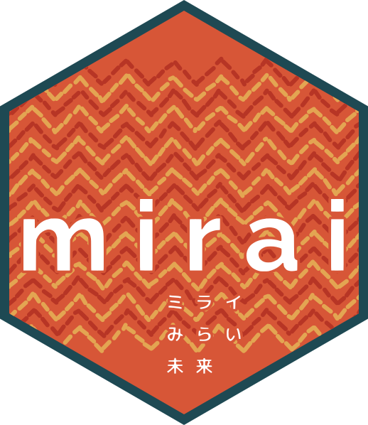

# Performance {.center .photo-full data-menu-title="Performance" background-image="images/brake.jpg" aria-label="Close-up of a car wheel with a red brake caliper"}

::: {.photo-credit}
Photo by [Lucas Cogrossi](https://unsplash.com/@lukecog) on [Unsplash](https://unsplash.com/photos/close-up-of-a-black-car-wheel-with-red-brake-caliper-FF2IFGz2lOM)
:::

::: {.fragment .fade-up}
::: {.statement}
Scale further. Scale safely.
:::
:::

# {.center .photo-full data-menu-title="Why Shiny?" background-image="images/shiny.jpg" aria-label="Sunlight sparkling in starbursts on the surface of dark water"}

::: {.photo-credit}
Photo by [Margarita B](https://unsplash.com/@margaritab) on [Unsplash](https://unsplash.com/photos/sunlight-sparkles-on-the-surface-of-dark-water-BXkzQhLBdkw)
:::

# A Shiny server is an event loop {data-menu-title="Why async"}

::: {.fragment .fade-up data-fragment-index="1"}
::: {.statement}
Async is never waiting for a result
:::
:::

::: {.scene}
```{=html}
<svg viewBox="0 0 1000 530" role="img" aria-label="Why async is essential for Shiny: left, a long task jams the event loop and every user waits; right, ExtendedTask hands the task to a daemon, the loop keeps turning, and the result lands when it is ready">
  <defs>
    <marker id="arrow" viewBox="0 0 10 10" refX="9" refY="5" markerWidth="7" markerHeight="7" orient="auto-start-reverse">
      <path d="M0,0 L10,5 L0,10 z" fill="#404041"/>
    </marker>
  </defs>

  <!-- LEFT — blocking: the task runs on the loop -->
  <rect class="machine" x="40" y="70" width="440" height="360" rx="16"/>
  <text class="machine-label" x="72" y="126" text-anchor="start" font-size="34">blocking</text>

  <circle class="user-dot" cx="95" cy="215" r="12" style="fill: var(--muted);"/>
  <circle class="user-dot" cx="95" cy="265" r="12" style="fill: var(--muted);"/>
  <circle class="user-dot" cx="95" cy="315" r="12" style="fill: var(--muted);"/>
  <text class="machine-sub" x="95" y="362" text-anchor="middle" font-size="18">waiting…</text>
  <path class="flow" d="M110,265 L146,265"/>

  <rect class="node" x="150" y="195" width="180" height="150" rx="14"/>
  <text class="node-label" x="240" y="230" text-anchor="middle" font-size="22">Shiny host</text>
  <path d="M240,262 A38,38 0 1 1 239,262" fill="none" stroke="var(--muted)" stroke-width="3.5" stroke-dasharray="7 6"/>
  <rect x="188" y="280" width="104" height="40" rx="8" fill="var(--danger)"/>
  <text x="240" y="307" text-anchor="middle" font-size="18" font-weight="700" fill="#ffffff">10 s task</text>
  <text x="240" y="394" text-anchor="middle" font-size="22" fill="var(--danger)">event loop frozen</text>

  <!-- RIGHT — async: the task is handed off (fragment reveal; shares index 1 with the statement below so they appear together) -->
  <g class="fragment" data-fragment-index="1">
  <rect class="machine" x="520" y="70" width="440" height="360" rx="16"/>
  <text class="machine-label" x="552" y="126" text-anchor="start" font-size="34">async</text>

  <circle class="user-dot" cx="575" cy="215" r="12"/>
  <circle class="user-dot" cx="575" cy="265" r="12"/>
  <circle class="user-dot" cx="575" cy="315" r="12"/>
  <path class="flow" d="M590,265 L626,265"/>

  <rect class="node" x="630" y="195" width="180" height="150" rx="14"/>
  <text class="node-label" x="720" y="230" text-anchor="middle" font-size="22">Shiny host</text>
  <path d="M720,262 A38,38 0 1 1 719,262" fill="none" stroke="var(--safe)" stroke-width="3.5" marker-end="url(#arrow)"/>

  <rect class="chip" x="862" y="262" width="78" height="76" rx="10"/>
  <text class="chip-label" x="901" y="307" text-anchor="middle" font-size="18">daemon</text>
  <path class="flow" d="M812,300 L858,300"/>
  <rect x="825" y="290" width="20" height="20" rx="4" fill="var(--posit-blue)"/>
  <path class="flow" d="M901,340 C901,380 782,392 732,350"/>

  <circle cx="748" cy="268" r="16" fill="var(--safe)"/>
  <path d="M740,268 L746,274 L757,262" fill="none" stroke="#ffffff" stroke-width="3.5" stroke-linecap="round" stroke-linejoin="round"/>
  <line x1="766" y1="252" x2="776" y2="242" stroke="var(--safe)" stroke-width="3.5" stroke-linecap="round"/>
  <line x1="772" y1="270" x2="783" y2="268" stroke="var(--safe)" stroke-width="3.5" stroke-linecap="round"/>
  <text x="720" y="394" text-anchor="middle" font-size="22" fill="var(--safe)">loop keeps turning</text>

  <!-- caption -->
  <text class="caption" x="500" y="475" text-anchor="middle" font-size="30">The task runs off the loop — the result lands when it's ready</text>
  <!-- API label: enlarged past the 30px apilbl rule (burgundy comes from .diagram-mono) -->
  <text class="diagram-mono" data-id="apilbl" x="500" y="520" text-anchor="middle" style="font-size: 40px;">ExtendedTask</text>
  </g>
</svg>
```
:::

<!-- ============================================================
ANIMATION PATTERN (decided 2026-07-22 — see outline.md):

  • Inline SVG per scene, using the recurring visual vocabulary:
      users (dots) → Shiny host → dispatcher (queue bar) → daemons.
      The queue bar doubles as the memory gauge — its fill colour
      tracks memory pressure (gauge/bar merge decided 2026-08-19).
  • AUTO-ANIMATE is the tweening engine: model each scene STATE as its
    own slide with `{auto-animate=true}`. Elements sharing a `data-id`
    are matched across slides and their geometry/style is interpolated
    (queue-fill width + colour, overlay opacity).
  • FRAGMENTS handle incremental reveals WITHIN a held slide
    (`.fragment` / `::: {.fragment}`), e.g. the branch-options list and
    the two-axis annotation on the Close assembly.
  • Colours come from custom.scss brand tokens: --safe (green),
    --warn (orange), --danger (burgundy) drive the memory bar.

SCENE CONVENTIONS (all scenes, built 2026-07-28):
  • COLD OPEN (added 2026-08-14): two slides before this one — a brakes/ABS
    photo (Unsplash, credited on-slide; the metaphor line is SPOKEN, the two
    axes are the fragment) and a STATIC reuse
    of the Beat 3 A′ OOM scene as a flash-forward (no auto-animate; new
    caption — it duplicates Beat 3 A′, keep them in sync). A third card,
    "What's new in 2026" (this slide's r-fit-text style, title only), sits
    between Beats 1 and 2 as the recap/new divider — so the Beat 1→2 morph
    below no longer runs.
  • Every state of a scene carries the SAME element set with the same
    data-ids — states differ only in geometry, colour and opacity, so
    nothing pops in or out unintentionally. To hide an element in a
    state, keep it and set `style="opacity: 0;"`.
  • viewBox is `0 0 1000 530` everywhere except Beat 2 (560 — its third
    machine bottoms out at y=440, so 30 extra units keep a line of air
    above the caption), and the shared vocabulary keeps its coordinates
    across beats (host 150,195 · dispatcher 360,165 · queue 386,255 ·
    daemons 790 at y 170/240/310), so a box never jumps
    between beats. Exception (2026-08-18): Beat 3 scenes B–C′ spread the
    daemons to y 140/240/340 — room for each daemon's own queue bar;
    auto-animate tweens the shift out of scene A′.
  • Caption at y=475 and the API label (mono, code burgundy) at y=520 are the two
    bottom text slots; Beat 2 uses y=500/545 (same physical position at
    its taller viewBox).
  • Function names shown as labels are verified against released CRAN
    packages — see "Verified API surface" in outline.md.
  • Beats 2 and 5 now enter on HARD CUTS, so no cross-beat auto-animate
    morph runs: the "What's new in 2026" divider sits between Beats 1 and 2,
    and the library photo card between Beats 4 and 5 (card added 2026-08-14;
    library photo replaces bus 2026-08-18).
    (The rule: a beat's first scene state must be adjacent to the previous
    beat's last state for the morph to run.)
  • custom.scss caps scene SVGs at max-height 380px so a title plus one
    fragment line stays inside reveal's 700px slide height — reveal CLIPS
    overflow, it does not scale per slide. Keep text under a scene to ~2
    short lines. (Raise the cap for a bigger room only if the fragment
    text shrinks to match.)
============================================================= -->

# Scaling safely {data-menu-title="Many users" data-state="sec-1"}

## Many users at once — the queue fills {auto-animate=true data-menu-title="Many users · A" data-state="sec-1"}

::: {.scene}
```{=html}
<svg viewBox="0 0 1000 530" role="img" aria-label="Scene A: many users queue tasks at the dispatcher, host memory climbing">
  <defs>
    <marker id="arrow" viewBox="0 0 10 10" refX="9" refY="5" markerWidth="7" markerHeight="7" orient="auto-start-reverse">
      <path d="M0,0 L10,5 L0,10 z" fill="#404041"/>
    </marker>
  </defs>

  <!-- users: many, at once -->
  <circle class="user-dot" data-id="u1" cx="38" cy="140" r="12"/>
  <circle class="user-dot" data-id="u2" cx="38" cy="190" r="12"/>
  <circle class="user-dot" data-id="u3" cx="38" cy="240" r="12"/>
  <circle class="user-dot" data-id="u4" cx="38" cy="290" r="12"/>
  <circle class="user-dot" data-id="u5" cx="38" cy="340" r="12"/>
  <circle class="user-dot" data-id="u6" cx="76" cy="140" r="12"/>
  <circle class="user-dot" data-id="u7" cx="76" cy="190" r="12"/>
  <circle class="user-dot" data-id="u8" cx="76" cy="240" r="12"/>
  <circle class="user-dot" data-id="u9" cx="76" cy="290" r="12"/>
  <circle class="user-dot" data-id="u10" cx="76" cy="340" r="12"/>
  <text class="node-label" data-id="ulbl" x="57" y="378" text-anchor="middle" font-size="18">users</text>
  <text class="machine-sub" data-id="usub" x="57" y="400" text-anchor="middle" font-size="15">many, at once</text>
  <path class="flow" data-id="f1" d="M100,240 L145,240"/>

  <!-- Shiny host -->
  <rect class="node" data-id="host" x="150" y="195" width="135" height="110" rx="14"/>
  <text class="node-label" data-id="hlbl" x="217" y="256" text-anchor="middle" font-size="22">Shiny host</text>
  <path class="flow" data-id="f2" d="M285,250 L355,250" style="opacity: 1;"/>

  <!-- dispatcher + its queue: the queue bar IS the memory gauge — fill colour tracks state -->
  <rect class="node" data-id="disp" x="360" y="165" width="300" height="210" rx="14" style="opacity: 1;"/>
  <text class="node-label" data-id="dlbl" x="510" y="197" text-anchor="middle" font-size="22" style="opacity: 1;">dispatcher</text>
  <rect class="queue-track" data-id="qtrack" x="386" y="255" width="210" height="42" rx="6" style="opacity: 1;"/>
  <rect class="queue-fill" data-id="qfill" x="386" y="255" width="96" height="42" rx="6" style="opacity: 1; fill: var(--warn);"/>
  <text class="node-label" data-id="glbl" x="388" y="320" text-anchor="start" font-size="18" style="opacity: 1;">memory</text>

  <!-- task flow: via dispatcher, or direct to daemons -->
  <path class="flow" data-id="fd1" d="M660,250 L790,198" style="opacity: 1;"/>
  <path class="flow" data-id="fd2" d="M660,270 L790,268" style="opacity: 1;"/>
  <path class="flow" data-id="fd3" d="M660,290 L790,338" style="opacity: 1;"/>
  <path class="flow" data-id="fh1" d="M336,232 L786,196" style="opacity: 0;"/>
  <path class="flow" data-id="fh2" d="M336,250 L786,266" style="opacity: 0;"/>
  <path class="flow" data-id="fh3" d="M336,268 L786,336" style="opacity: 0;"/>

  <!-- daemons, each with its own queue bar once dispatcher is off -->
  <rect class="node" data-id="d1" x="790" y="170" width="180" height="56" rx="10"/>
  <text class="node-label" data-id="d1l" x="880" y="204" text-anchor="middle" font-size="18">daemon 1</text>
  <rect class="dq-track" data-id="dqt1" x="806" y="202" width="124" height="13" rx="3" style="opacity: 0;"/>
  <rect class="dq-fill" data-id="dqf1" x="806" y="202" width="0" height="13" rx="3" style="opacity: 0; fill: var(--warn);"/>
  <rect class="node" data-id="d2" x="790" y="240" width="180" height="56" rx="10"/>
  <text class="node-label" data-id="d2l" x="880" y="274" text-anchor="middle" font-size="18">daemon 2</text>
  <rect class="dq-track" data-id="dqt2" x="806" y="272" width="124" height="13" rx="3" style="opacity: 0;"/>
  <rect class="dq-fill" data-id="dqf2" x="806" y="272" width="0" height="13" rx="3" style="opacity: 0; fill: var(--warn);"/>
  <rect class="node" data-id="d3" x="790" y="310" width="180" height="56" rx="10"/>
  <text class="node-label" data-id="d3l" x="880" y="344" text-anchor="middle" font-size="18">daemon 3</text>
  <rect class="dq-track" data-id="dqt3" x="806" y="342" width="124" height="13" rx="3" style="opacity: 0;"/>
  <rect class="dq-fill" data-id="dqf3" x="806" y="342" width="0" height="13" rx="3" style="opacity: 0; fill: var(--safe);"/>

  <!-- OOM badge · on-demand relaunch -->
  <rect class="oom-box" data-id="oomb" x="467" y="310" width="86" height="36" rx="8" style="opacity: 0;"/>
  <text class="oom-text" data-id="oomt" x="510" y="335" text-anchor="middle" font-size="22" style="opacity: 0;">OOM</text>
  <rect class="relay" data-id="rlb" x="660" y="386" width="110" height="32" rx="8" style="opacity: 0;"/>
  <text class="relay-label" data-id="rlt" x="715" y="407" text-anchor="middle" font-size="15" style="opacity: 0;">launcher</text>
  <path class="flow" data-id="rla" d="M775,394 L786,284" style="opacity: 0;"/>

  <!-- caption -->
  <text class="caption" data-id="captext" x="500" y="475" text-anchor="middle" font-size="30">Every queued task holds its data at the dispatcher</text>
  <text class="diagram-mono" data-id="apilbl" x="500" y="520" text-anchor="middle" font-size="30">daemons(3)</text>
</svg>
```
:::

## The dispatcher runs out of memory {auto-animate=true data-menu-title="Many users · A′" data-state="sec-1"}

::: {.scene}
```{=html}
<svg viewBox="0 0 1000 530" role="img" aria-label="Scene A prime: the dispatcher hits OOM and task flow stops for everyone">
  <defs>
    <marker id="arrow" viewBox="0 0 10 10" refX="9" refY="5" markerWidth="7" markerHeight="7" orient="auto-start-reverse">
      <path d="M0,0 L10,5 L0,10 z" fill="#404041"/>
    </marker>
  </defs>

  <!-- users: many, at once -->
  <circle class="user-dot" data-id="u1" cx="38" cy="140" r="12"/>
  <circle class="user-dot" data-id="u2" cx="38" cy="190" r="12"/>
  <circle class="user-dot" data-id="u3" cx="38" cy="240" r="12"/>
  <circle class="user-dot" data-id="u4" cx="38" cy="290" r="12"/>
  <circle class="user-dot" data-id="u5" cx="38" cy="340" r="12"/>
  <circle class="user-dot" data-id="u6" cx="76" cy="140" r="12"/>
  <circle class="user-dot" data-id="u7" cx="76" cy="190" r="12"/>
  <circle class="user-dot" data-id="u8" cx="76" cy="240" r="12"/>
  <circle class="user-dot" data-id="u9" cx="76" cy="290" r="12"/>
  <circle class="user-dot" data-id="u10" cx="76" cy="340" r="12"/>
  <text class="node-label" data-id="ulbl" x="57" y="378" text-anchor="middle" font-size="18">users</text>
  <text class="machine-sub" data-id="usub" x="57" y="400" text-anchor="middle" font-size="15">many, at once</text>
  <path class="flow" data-id="f1" d="M100,240 L145,240"/>

  <!-- Shiny host -->
  <rect class="node" data-id="host" x="150" y="195" width="135" height="110" rx="14"/>
  <text class="node-label" data-id="hlbl" x="217" y="256" text-anchor="middle" font-size="22">Shiny host</text>
  <path class="flow" data-id="f2" d="M285,250 L355,250" style="opacity: 0.2;"/>

  <!-- dispatcher + its queue: the queue bar IS the memory gauge — fill colour tracks state -->
  <rect class="node dead" data-id="disp" x="360" y="165" width="300" height="210" rx="14" style="opacity: 1;"/>
  <text class="node-label dead-label" data-id="dlbl" x="510" y="197" text-anchor="middle" font-size="22" style="opacity: 1;">dispatcher</text>
  <rect class="queue-track" data-id="qtrack" x="386" y="255" width="210" height="42" rx="6" style="opacity: 1;"/>
  <rect class="queue-fill" data-id="qfill" x="386" y="255" width="210" height="42" rx="6" style="opacity: 1; fill: var(--danger);"/>
  <text class="node-label" data-id="glbl" x="388" y="320" text-anchor="start" font-size="18" style="opacity: 1;">memory</text>

  <!-- task flow: via dispatcher, or direct to daemons -->
  <path class="flow" data-id="fd1" d="M660,250 L790,198" style="opacity: 0.1;"/>
  <path class="flow" data-id="fd2" d="M660,270 L790,268" style="opacity: 0.1;"/>
  <path class="flow" data-id="fd3" d="M660,290 L790,338" style="opacity: 0.1;"/>
  <path class="flow" data-id="fh1" d="M336,232 L786,196" style="opacity: 0;"/>
  <path class="flow" data-id="fh2" d="M336,250 L786,266" style="opacity: 0;"/>
  <path class="flow" data-id="fh3" d="M336,268 L786,336" style="opacity: 0;"/>

  <!-- daemons, each with its own queue bar once dispatcher is off -->
  <rect class="node" data-id="d1" x="790" y="170" width="180" height="56" rx="10"/>
  <text class="node-label" data-id="d1l" x="880" y="204" text-anchor="middle" font-size="18">daemon 1</text>
  <rect class="dq-track" data-id="dqt1" x="806" y="202" width="124" height="13" rx="3" style="opacity: 0;"/>
  <rect class="dq-fill" data-id="dqf1" x="806" y="202" width="0" height="13" rx="3" style="opacity: 0; fill: var(--warn);"/>
  <rect class="node" data-id="d2" x="790" y="240" width="180" height="56" rx="10"/>
  <text class="node-label" data-id="d2l" x="880" y="274" text-anchor="middle" font-size="18">daemon 2</text>
  <rect class="dq-track" data-id="dqt2" x="806" y="272" width="124" height="13" rx="3" style="opacity: 0;"/>
  <rect class="dq-fill" data-id="dqf2" x="806" y="272" width="0" height="13" rx="3" style="opacity: 0; fill: var(--warn);"/>
  <rect class="node" data-id="d3" x="790" y="310" width="180" height="56" rx="10"/>
  <text class="node-label" data-id="d3l" x="880" y="344" text-anchor="middle" font-size="18">daemon 3</text>
  <rect class="dq-track" data-id="dqt3" x="806" y="342" width="124" height="13" rx="3" style="opacity: 0;"/>
  <rect class="dq-fill" data-id="dqf3" x="806" y="342" width="0" height="13" rx="3" style="opacity: 0; fill: var(--safe);"/>

  <!-- OOM badge · on-demand relaunch -->
  <rect class="oom-box" data-id="oomb" x="467" y="310" width="86" height="36" rx="8" style="opacity: 1;"/>
  <text class="oom-text" data-id="oomt" x="510" y="335" text-anchor="middle" font-size="22" style="opacity: 1;">OOM</text>
  <rect class="relay" data-id="rlb" x="660" y="386" width="110" height="32" rx="8" style="opacity: 0;"/>
  <text class="relay-label" data-id="rlt" x="715" y="407" text-anchor="middle" font-size="15" style="opacity: 0;">launcher</text>
  <path class="flow" data-id="rla" d="M775,394 L786,284" style="opacity: 0;"/>

  <!-- caption -->
  <text class="caption" data-id="captext" x="500" y="475" text-anchor="middle" font-size="30" style="fill: var(--danger);">One process dies — and task flow stops for every user</text>
  <text class="diagram-mono" data-id="apilbl" x="500" y="520" text-anchor="middle" font-size="30">daemons(3)</text>
</svg>
```
:::

## Switch the dispatcher off — the queue spreads {auto-animate=true data-menu-title="Many users · B" data-state="sec-1"}

::: {.scene}
```{=html}
<svg viewBox="0 0 1000 530" role="img" aria-label="Scene B: with dispatcher off, tasks queue at each daemon and memory spreads">
  <defs>
    <marker id="arrow" viewBox="0 0 10 10" refX="9" refY="5" markerWidth="7" markerHeight="7" orient="auto-start-reverse">
      <path d="M0,0 L10,5 L0,10 z" fill="#404041"/>
    </marker>
  </defs>

  <!-- users: many, at once -->
  <circle class="user-dot" data-id="u1" cx="38" cy="140" r="12"/>
  <circle class="user-dot" data-id="u2" cx="38" cy="190" r="12"/>
  <circle class="user-dot" data-id="u3" cx="38" cy="240" r="12"/>
  <circle class="user-dot" data-id="u4" cx="38" cy="290" r="12"/>
  <circle class="user-dot" data-id="u5" cx="38" cy="340" r="12"/>
  <circle class="user-dot" data-id="u6" cx="76" cy="140" r="12"/>
  <circle class="user-dot" data-id="u7" cx="76" cy="190" r="12"/>
  <circle class="user-dot" data-id="u8" cx="76" cy="240" r="12"/>
  <circle class="user-dot" data-id="u9" cx="76" cy="290" r="12"/>
  <circle class="user-dot" data-id="u10" cx="76" cy="340" r="12"/>
  <text class="node-label" data-id="ulbl" x="57" y="378" text-anchor="middle" font-size="18">users</text>
  <text class="machine-sub" data-id="usub" x="57" y="400" text-anchor="middle" font-size="15">many, at once</text>
  <path class="flow" data-id="f1" d="M100,240 L145,240"/>

  <!-- Shiny host -->
  <rect class="node" data-id="host" x="150" y="195" width="135" height="110" rx="14"/>
  <text class="node-label" data-id="hlbl" x="217" y="256" text-anchor="middle" font-size="22">Shiny host</text>
  <path class="flow" data-id="f2" d="M285,250 L355,250" style="opacity: 0;"/>

  <!-- dispatcher + its queue: the queue bar IS the memory gauge — fill colour tracks state -->
  <rect class="node" data-id="disp" x="360" y="165" width="300" height="210" rx="14" style="opacity: 0;"/>
  <text class="node-label" data-id="dlbl" x="510" y="197" text-anchor="middle" font-size="22" style="opacity: 0;">dispatcher</text>
  <rect class="queue-track" data-id="qtrack" x="386" y="255" width="210" height="42" rx="6" style="opacity: 0;"/>
  <rect class="queue-fill" data-id="qfill" x="386" y="255" width="210" height="42" rx="6" style="opacity: 0; fill: var(--danger);"/>
  <text class="node-label" data-id="glbl" x="388" y="320" text-anchor="start" font-size="18" style="opacity: 0;">memory</text>

  <!-- task flow: via dispatcher, or direct to daemons -->
  <path class="flow" data-id="fd1" d="M660,250 L790,168" style="opacity: 0;"/>
  <path class="flow" data-id="fd2" d="M660,270 L790,268" style="opacity: 0;"/>
  <path class="flow" data-id="fd3" d="M660,290 L790,368" style="opacity: 0;"/>
  <path class="flow" data-id="fh1" d="M336,232 L786,166" style="opacity: 1;"/>
  <path class="flow" data-id="fh2" d="M336,250 L786,266" style="opacity: 1;"/>
  <path class="flow" data-id="fh3" d="M336,268 L786,366" style="opacity: 1;"/>

  <!-- daemons, each with its own queue bar once dispatcher is off -->
  <rect class="node" data-id="d1" x="790" y="140" width="180" height="56" rx="10"/>
  <text class="node-label" data-id="d1l" x="868" y="162" text-anchor="middle" font-size="18">daemon 1</text>
  <rect class="dq-track" data-id="dqt1" x="806" y="172" width="124" height="13" rx="3" style="opacity: 1;"/>
  <rect class="dq-fill" data-id="dqf1" x="806" y="172" width="62" height="13" rx="3" style="opacity: 1; fill: var(--warn);"/>
  <rect class="node" data-id="d2" x="790" y="240" width="180" height="56" rx="10"/>
  <text class="node-label" data-id="d2l" x="868" y="262" text-anchor="middle" font-size="18">daemon 2</text>
  <rect class="dq-track" data-id="dqt2" x="806" y="272" width="124" height="13" rx="3" style="opacity: 1;"/>
  <rect class="dq-fill" data-id="dqf2" x="806" y="272" width="118" height="13" rx="3" style="opacity: 1; fill: var(--warn);"/>
  <rect class="node" data-id="d3" x="790" y="340" width="180" height="56" rx="10"/>
  <text class="node-label" data-id="d3l" x="868" y="362" text-anchor="middle" font-size="18">daemon 3</text>
  <rect class="dq-track" data-id="dqt3" x="806" y="372" width="124" height="13" rx="3" style="opacity: 1;"/>
  <rect class="dq-fill" data-id="dqf3" x="806" y="372" width="24" height="13" rx="3" style="opacity: 1; fill: var(--safe);"/>

  <!-- OOM badge · on-demand relaunch -->
  <rect class="oom-box" data-id="oomb" x="676" y="250" width="86" height="36" rx="8" style="opacity: 0;"/>
  <text class="oom-text" data-id="oomt" x="719" y="275" text-anchor="middle" font-size="22" style="opacity: 0;">OOM</text>
  <rect class="relay" data-id="rlb" x="660" y="386" width="110" height="32" rx="8" style="opacity: 0;"/>
  <text class="relay-label" data-id="rlt" x="715" y="407" text-anchor="middle" font-size="15" style="opacity: 0;">launcher</text>
  <path class="flow" data-id="rla" d="M775,394 L786,284" style="opacity: 0;"/>

  <!-- caption -->
  <text class="caption" data-id="captext" x="500" y="475" text-anchor="middle" font-size="30">Sub-optimal: a slow task strands everything queued behind it</text>
  <text class="diagram-mono" data-id="apilbl" x="500" y="520" text-anchor="middle" font-size="30">daemons(3, dispatcher = FALSE)</text>
</svg>
```
:::

## A daemon dies — and only its queue goes with it {auto-animate=true data-menu-title="Many users · C" data-state="sec-1"}

::: {.scene}
```{=html}
<svg viewBox="0 0 1000 530" role="img" aria-label="Scene C: one daemon OOMs and dies, taking only its own queue">
  <defs>
    <marker id="arrow" viewBox="0 0 10 10" refX="9" refY="5" markerWidth="7" markerHeight="7" orient="auto-start-reverse">
      <path d="M0,0 L10,5 L0,10 z" fill="#404041"/>
    </marker>
  </defs>

  <!-- users: many, at once -->
  <circle class="user-dot" data-id="u1" cx="38" cy="140" r="12"/>
  <circle class="user-dot" data-id="u2" cx="38" cy="190" r="12"/>
  <circle class="user-dot" data-id="u3" cx="38" cy="240" r="12"/>
  <circle class="user-dot" data-id="u4" cx="38" cy="290" r="12"/>
  <circle class="user-dot" data-id="u5" cx="38" cy="340" r="12"/>
  <circle class="user-dot" data-id="u6" cx="76" cy="140" r="12"/>
  <circle class="user-dot" data-id="u7" cx="76" cy="190" r="12"/>
  <circle class="user-dot" data-id="u8" cx="76" cy="240" r="12"/>
  <circle class="user-dot" data-id="u9" cx="76" cy="290" r="12"/>
  <circle class="user-dot" data-id="u10" cx="76" cy="340" r="12"/>
  <text class="node-label" data-id="ulbl" x="57" y="378" text-anchor="middle" font-size="18">users</text>
  <text class="machine-sub" data-id="usub" x="57" y="400" text-anchor="middle" font-size="15">many, at once</text>
  <path class="flow" data-id="f1" d="M100,240 L145,240"/>

  <!-- Shiny host -->
  <rect class="node" data-id="host" x="150" y="195" width="135" height="110" rx="14"/>
  <text class="node-label" data-id="hlbl" x="217" y="256" text-anchor="middle" font-size="22">Shiny host</text>
  <path class="flow" data-id="f2" d="M285,250 L355,250" style="opacity: 0;"/>

  <!-- dispatcher + its queue: the queue bar IS the memory gauge — fill colour tracks state -->
  <rect class="node" data-id="disp" x="360" y="165" width="300" height="210" rx="14" style="opacity: 0;"/>
  <text class="node-label" data-id="dlbl" x="510" y="197" text-anchor="middle" font-size="22" style="opacity: 0;">dispatcher</text>
  <rect class="queue-track" data-id="qtrack" x="386" y="255" width="210" height="42" rx="6" style="opacity: 0;"/>
  <rect class="queue-fill" data-id="qfill" x="386" y="255" width="210" height="42" rx="6" style="opacity: 0; fill: var(--danger);"/>
  <text class="node-label" data-id="glbl" x="388" y="320" text-anchor="start" font-size="18" style="opacity: 0;">memory</text>

  <!-- task flow: via dispatcher, or direct to daemons -->
  <path class="flow" data-id="fd1" d="M660,250 L790,168" style="opacity: 0;"/>
  <path class="flow" data-id="fd2" d="M660,270 L790,268" style="opacity: 0;"/>
  <path class="flow" data-id="fd3" d="M660,290 L790,368" style="opacity: 0;"/>
  <path class="flow" data-id="fh1" d="M336,232 L786,166" style="opacity: 1;"/>
  <path class="flow" data-id="fh2" d="M336,250 L786,266" style="opacity: 0.1;"/>
  <path class="flow" data-id="fh3" d="M336,268 L786,366" style="opacity: 1;"/>

  <!-- daemons, each with its own queue bar once dispatcher is off -->
  <rect class="node" data-id="d1" x="790" y="140" width="180" height="56" rx="10"/>
  <text class="node-label" data-id="d1l" x="868" y="162" text-anchor="middle" font-size="18">daemon 1</text>
  <rect class="dq-track" data-id="dqt1" x="806" y="172" width="124" height="13" rx="3" style="opacity: 1;"/>
  <rect class="dq-fill" data-id="dqf1" x="806" y="172" width="86" height="13" rx="3" style="opacity: 1; fill: var(--warn);"/>
  <rect class="node dead" data-id="d2" x="790" y="240" width="180" height="56" rx="10"/>
  <text class="node-label dead-label" data-id="d2l" x="868" y="262" text-anchor="middle" font-size="18">daemon 2</text>
  <rect class="dq-track" data-id="dqt2" x="806" y="272" width="124" height="13" rx="3" style="opacity: 1;"/>
  <rect class="dq-fill" data-id="dqf2" x="806" y="272" width="118" height="13" rx="3" style="opacity: 0.2; fill: var(--danger);"/>
  <rect class="node" data-id="d3" x="790" y="340" width="180" height="56" rx="10"/>
  <text class="node-label" data-id="d3l" x="868" y="362" text-anchor="middle" font-size="18">daemon 3</text>
  <rect class="dq-track" data-id="dqt3" x="806" y="372" width="124" height="13" rx="3" style="opacity: 1;"/>
  <rect class="dq-fill" data-id="dqf3" x="806" y="372" width="40" height="13" rx="3" style="opacity: 1; fill: var(--safe);"/>

  <!-- OOM badge · on-demand relaunch -->
  <rect class="oom-box" data-id="oomb" x="676" y="250" width="86" height="36" rx="8" style="opacity: 1;"/>
  <text class="oom-text" data-id="oomt" x="719" y="275" text-anchor="middle" font-size="22" style="opacity: 1;">OOM</text>
  <rect class="relay" data-id="rlb" x="660" y="386" width="110" height="32" rx="8" style="opacity: 0;"/>
  <text class="relay-label" data-id="rlt" x="715" y="407" text-anchor="middle" font-size="15" style="opacity: 0;">launcher</text>
  <path class="flow" data-id="rla" d="M775,394 L786,284" style="opacity: 0;"/>

  <!-- caption -->
  <text class="caption" data-id="captext" x="500" y="475" text-anchor="middle" font-size="30">Only that daemon's queue is lost — everyone else keeps going</text>
  <text class="diagram-mono" data-id="apilbl" x="500" y="520" text-anchor="middle" font-size="30">daemons(3, dispatcher = FALSE)</text>
</svg>
```
:::

## Relaunch on demand<br>&nbsp; {auto-animate=true data-menu-title="Many users · C′" data-state="sec-1"}

::: {.scene}
```{=html}
<svg viewBox="0 0 1000 530" role="img" aria-label="Scene C prime: a launcher spins up a replacement daemon and work continues">
  <defs>
    <marker id="arrow" viewBox="0 0 10 10" refX="9" refY="5" markerWidth="7" markerHeight="7" orient="auto-start-reverse">
      <path d="M0,0 L10,5 L0,10 z" fill="#404041"/>
    </marker>
  </defs>

  <!-- users: many, at once -->
  <circle class="user-dot" data-id="u1" cx="38" cy="140" r="12"/>
  <circle class="user-dot" data-id="u2" cx="38" cy="190" r="12"/>
  <circle class="user-dot" data-id="u3" cx="38" cy="240" r="12"/>
  <circle class="user-dot" data-id="u4" cx="38" cy="290" r="12"/>
  <circle class="user-dot" data-id="u5" cx="38" cy="340" r="12"/>
  <circle class="user-dot" data-id="u6" cx="76" cy="140" r="12"/>
  <circle class="user-dot" data-id="u7" cx="76" cy="190" r="12"/>
  <circle class="user-dot" data-id="u8" cx="76" cy="240" r="12"/>
  <circle class="user-dot" data-id="u9" cx="76" cy="290" r="12"/>
  <circle class="user-dot" data-id="u10" cx="76" cy="340" r="12"/>
  <text class="node-label" data-id="ulbl" x="57" y="378" text-anchor="middle" font-size="18">users</text>
  <text class="machine-sub" data-id="usub" x="57" y="400" text-anchor="middle" font-size="15">many, at once</text>
  <path class="flow" data-id="f1" d="M100,240 L145,240"/>

  <!-- Shiny host -->
  <rect class="node" data-id="host" x="150" y="195" width="135" height="110" rx="14"/>
  <text class="node-label" data-id="hlbl" x="217" y="256" text-anchor="middle" font-size="22">Shiny host</text>
  <path class="flow" data-id="f2" d="M285,250 L355,250" style="opacity: 0;"/>

  <!-- dispatcher + its queue: the queue bar IS the memory gauge — fill colour tracks state -->
  <rect class="node" data-id="disp" x="360" y="165" width="300" height="210" rx="14" style="opacity: 0;"/>
  <text class="node-label" data-id="dlbl" x="510" y="197" text-anchor="middle" font-size="22" style="opacity: 0;">dispatcher</text>
  <rect class="queue-track" data-id="qtrack" x="386" y="255" width="210" height="42" rx="6" style="opacity: 0;"/>
  <rect class="queue-fill" data-id="qfill" x="386" y="255" width="210" height="42" rx="6" style="opacity: 0; fill: var(--danger);"/>
  <text class="node-label" data-id="glbl" x="388" y="320" text-anchor="start" font-size="18" style="opacity: 0;">memory</text>

  <!-- task flow: via dispatcher, or direct to daemons -->
  <path class="flow" data-id="fd1" d="M660,250 L790,168" style="opacity: 0;"/>
  <path class="flow" data-id="fd2" d="M660,270 L790,268" style="opacity: 0;"/>
  <path class="flow" data-id="fd3" d="M660,290 L790,368" style="opacity: 0;"/>
  <path class="flow" data-id="fh1" d="M336,232 L786,166" style="opacity: 1;"/>
  <path class="flow" data-id="fh2" d="M336,250 L786,266" style="opacity: 1;"/>
  <path class="flow" data-id="fh3" d="M336,268 L786,366" style="opacity: 1;"/>

  <!-- daemons, each with its own queue bar once dispatcher is off -->
  <rect class="node" data-id="d1" x="790" y="140" width="180" height="56" rx="10"/>
  <text class="node-label" data-id="d1l" x="868" y="162" text-anchor="middle" font-size="18">daemon 1</text>
  <rect class="dq-track" data-id="dqt1" x="806" y="172" width="124" height="13" rx="3" style="opacity: 1;"/>
  <rect class="dq-fill" data-id="dqf1" x="806" y="172" width="70" height="13" rx="3" style="opacity: 1; fill: var(--warn);"/>
  <rect class="node" data-id="d2" x="790" y="240" width="180" height="56" rx="10"/>
  <text class="node-label" data-id="d2l" x="868" y="262" text-anchor="middle" font-size="18">daemon 2</text>
  <rect class="dq-track" data-id="dqt2" x="806" y="272" width="124" height="13" rx="3" style="opacity: 1;"/>
  <rect class="dq-fill" data-id="dqf2" x="806" y="272" width="10" height="13" rx="3" style="opacity: 1; fill: var(--safe);"/>
  <rect class="node" data-id="d3" x="790" y="340" width="180" height="56" rx="10"/>
  <text class="node-label" data-id="d3l" x="868" y="362" text-anchor="middle" font-size="18">daemon 3</text>
  <rect class="dq-track" data-id="dqt3" x="806" y="372" width="124" height="13" rx="3" style="opacity: 1;"/>
  <rect class="dq-fill" data-id="dqf3" x="806" y="372" width="34" height="13" rx="3" style="opacity: 1; fill: var(--safe);"/>

  <!-- OOM badge · on-demand relaunch -->
  <rect class="oom-box" data-id="oomb" x="676" y="250" width="86" height="36" rx="8" style="opacity: 0;"/>
  <text class="oom-text" data-id="oomt" x="719" y="275" text-anchor="middle" font-size="22" style="opacity: 0;">OOM</text>
  <rect class="relay" data-id="rlb" x="540" y="386" width="110" height="32" rx="8" style="opacity: 1;"/>
  <text class="relay-label" data-id="rlt" x="595" y="407" text-anchor="middle" font-size="15" style="opacity: 1;">launcher</text>
  <path class="flow" data-id="rla" d="M652,388 L786,290" style="opacity: 1;"/>

  <!-- caption -->
  <text class="caption" data-id="captext" x="500" y="475" text-anchor="middle" font-size="30">A replacement is launched on demand — work continues</text>
  <text class="diagram-mono" data-id="apilbl" x="500" y="520" text-anchor="middle" font-size="30">launch_remote(1)</text>
</svg>
```
:::

::: {.fragment .fade-up}
::: {.statement}
Recovery — not prevention
:::
:::

# Bounded queue + `try_mirai()` {data-menu-title="Bounded queue" data-state="sec-2"}

<!-- ── WORKED SCENE: three auto-animate states (A → B → C) ── -->

## The bound {auto-animate=true data-menu-title="Bounded queue · A" data-state="sec-2"}

::: {.scene}
```{=html}
<svg viewBox="0 0 1000 530" role="img" aria-label="Bounded dispatcher queue, Scene A">
  <defs>
    <marker id="arrow" viewBox="0 0 10 10" refX="9" refY="5" markerWidth="7" markerHeight="7" orient="auto-start-reverse">
      <path d="M0,0 L10,5 L0,10 z" fill="#404041"/>
    </marker>
  </defs>

  <!-- users -->
  <circle class="user-dot" data-id="u1" cx="45" cy="140" r="12"/>
  <circle class="user-dot" data-id="u2" cx="45" cy="190" r="12"/>
  <circle class="user-dot" data-id="u3" cx="45" cy="240" r="12"/>
  <circle class="user-dot" data-id="u4" cx="45" cy="290" r="12"/>
  <circle class="user-dot" data-id="u5" cx="45" cy="340" r="12"/>
  <text class="node-label" data-id="ulbl" x="45" y="380" text-anchor="middle" font-size="18">users</text>
  <path class="flow" data-id="f1" d="M75,240 L145,240"/>

  <!-- Shiny host -->
  <rect class="node" data-id="host" x="150" y="195" width="135" height="110" rx="14"/>
  <text class="node-label" data-id="hlbl" x="217" y="256" text-anchor="middle" font-size="22">Shiny host</text>
  <path class="flow" data-id="f2" d="M285,250 L355,250"/>

  <!-- dispatcher — the queue bar IS the memory gauge: fill colour tracks state -->
  <rect class="node" data-id="disp" x="360" y="165" width="300" height="210" rx="14"/>
  <text class="node-label" data-id="dlbl" x="510" y="197" text-anchor="middle" font-size="22">dispatcher</text>
  <rect class="queue-track" data-id="qtrack" x="386" y="255" width="210" height="42" rx="6"/>
  <rect class="queue-fill"  data-id="qfill"  x="386" y="255" width="118" height="42" rx="6" style="fill: var(--safe);"/>
  <line class="cap-line" data-id="cap" x1="526" y1="245" x2="526" y2="307"/>
  <text class="cap-label" data-id="caplbl" x="526" y="237" text-anchor="middle" font-size="18">bound</text>
  <text class="node-label" data-id="glbl" x="388" y="320" text-anchor="start" font-size="18">memory</text>

  <!-- daemons -->
  <rect class="node" data-id="d1" x="790" y="170" width="180" height="56" rx="10"/>
  <text class="node-label" data-id="d1l" x="880" y="204" text-anchor="middle" font-size="18">daemon 1</text>
  <rect class="node" data-id="d2" x="790" y="240" width="180" height="56" rx="10"/>
  <text class="node-label" data-id="d2l" x="880" y="274" text-anchor="middle" font-size="18">daemon 2</text>
  <rect class="node" data-id="d3" x="790" y="310" width="180" height="56" rx="10"/>
  <text class="node-label" data-id="d3l" x="880" y="344" text-anchor="middle" font-size="18">daemon 3</text>
  <path class="flow" data-id="fd1" d="M660,250 L790,198"/>
  <path class="flow" data-id="fd2" d="M660,270 L790,268"/>
  <path class="flow" data-id="fd3" d="M660,290 L790,338"/>

  <!-- freeze overlay (hidden in A) -->
  <rect class="freeze" data-id="freeze" x="145" y="155" width="520" height="235" rx="14" style="opacity: 0;"/>
  <text class="freeze-label" data-id="freezelbl" x="405" y="278" text-anchor="middle" font-size="26" style="opacity: 0;">event loop frozen</text>

  <!-- try_mirai NULL tag (hidden in A) -->
  <rect class="null-tag-box" data-id="ntbox" x="292" y="226" width="66" height="34" rx="8" style="opacity: 0;"/>
  <text class="null-tag-text" data-id="nttext" x="325" y="250" text-anchor="middle" font-size="18" style="opacity: 0;">NULL</text>

  <!-- caption -->
  <text class="caption" data-id="captext" x="500" y="475" text-anchor="middle" font-size="30">The queue fills to the bound — and no further</text>
  <text class="diagram-mono" data-id="apilbl" x="500" y="520" text-anchor="middle" font-size="30">daemons(memory = …)</text>
</svg>
```
:::

## At the line, `mirai()` blocks {auto-animate=true data-menu-title="Bounded queue · B" data-state="sec-2"}

::: {.scene}
```{=html}
<svg viewBox="0 0 1000 530" role="img" aria-label="Bounded dispatcher queue, Scene B">
  <defs>
    <marker id="arrow" viewBox="0 0 10 10" refX="9" refY="5" markerWidth="7" markerHeight="7" orient="auto-start-reverse">
      <path d="M0,0 L10,5 L0,10 z" fill="#404041"/>
    </marker>
  </defs>

  <circle class="user-dot" data-id="u1" cx="45" cy="140" r="12"/>
  <circle class="user-dot" data-id="u2" cx="45" cy="190" r="12"/>
  <circle class="user-dot" data-id="u3" cx="45" cy="240" r="12"/>
  <circle class="user-dot" data-id="u4" cx="45" cy="290" r="12"/>
  <circle class="user-dot" data-id="u5" cx="45" cy="340" r="12"/>
  <text class="node-label" data-id="ulbl" x="45" y="380" text-anchor="middle" font-size="18">users</text>
  <path class="flow" data-id="f1" d="M75,240 L145,240"/>

  <rect class="node" data-id="host" x="150" y="195" width="135" height="110" rx="14"/>
  <text class="node-label" data-id="hlbl" x="217" y="256" text-anchor="middle" font-size="22">Shiny host</text>
  <path class="flow" data-id="f2" d="M285,250 L355,250"/>

  <rect class="node" data-id="disp" x="360" y="165" width="300" height="210" rx="14"/>
  <text class="node-label" data-id="dlbl" x="510" y="197" text-anchor="middle" font-size="22">dispatcher</text>
  <rect class="queue-track" data-id="qtrack" x="386" y="255" width="210" height="42" rx="6"/>
  <rect class="queue-fill"  data-id="qfill"  x="386" y="255" width="140" height="42" rx="6" style="fill: var(--warn);"/>
  <line class="cap-line" data-id="cap" x1="526" y1="245" x2="526" y2="307"/>
  <text class="cap-label" data-id="caplbl" x="526" y="237" text-anchor="middle" font-size="18">bound</text>
  <text class="node-label" data-id="glbl" x="388" y="320" text-anchor="start" font-size="18">memory</text>

  <rect class="node" data-id="d1" x="790" y="170" width="180" height="56" rx="10"/>
  <text class="node-label" data-id="d1l" x="880" y="204" text-anchor="middle" font-size="18">daemon 1</text>
  <rect class="node" data-id="d2" x="790" y="240" width="180" height="56" rx="10"/>
  <text class="node-label" data-id="d2l" x="880" y="274" text-anchor="middle" font-size="18">daemon 2</text>
  <rect class="node" data-id="d3" x="790" y="310" width="180" height="56" rx="10"/>
  <text class="node-label" data-id="d3l" x="880" y="344" text-anchor="middle" font-size="18">daemon 3</text>
  <path class="flow" data-id="fd1" d="M660,250 L790,198"/>
  <path class="flow" data-id="fd2" d="M660,270 L790,268"/>
  <path class="flow" data-id="fd3" d="M660,290 L790,338"/>

  <rect class="freeze" data-id="freeze" x="145" y="155" width="520" height="235" rx="14" style="opacity: 0.55;"/>
  <text class="freeze-label" data-id="freezelbl" x="405" y="278" text-anchor="middle" font-size="26" style="opacity: 1;">event loop frozen</text>

  <rect class="null-tag-box" data-id="ntbox" x="292" y="226" width="66" height="34" rx="8" style="opacity: 0;"/>
  <text class="null-tag-text" data-id="nttext" x="325" y="250" text-anchor="middle" font-size="18" style="opacity: 0;">NULL</text>

  <text class="caption danger-caption" data-id="captext" x="500" y="475" text-anchor="middle" font-size="30" style="fill: var(--danger);">Every user's session greys out — unacceptable for Shiny</text>
  <text class="diagram-mono" data-id="apilbl" x="500" y="520" text-anchor="middle" font-size="30">mirai()<tspan style="fill: var(--posit-blue);"> blocks the event loop</tspan></text>
</svg>
```
:::

## `try_mirai()` → `NULL` {auto-animate=true data-menu-title="Bounded queue · C" data-state="sec-2"}

::: {.scene}
```{=html}
<svg viewBox="0 0 1000 530" role="img" aria-label="Bounded dispatcher queue, Scene C">
  <defs>
    <marker id="arrow" viewBox="0 0 10 10" refX="9" refY="5" markerWidth="7" markerHeight="7" orient="auto-start-reverse">
      <path d="M0,0 L10,5 L0,10 z" fill="#404041"/>
    </marker>
  </defs>

  <circle class="user-dot" data-id="u1" cx="45" cy="140" r="12"/>
  <circle class="user-dot" data-id="u2" cx="45" cy="190" r="12"/>
  <circle class="user-dot" data-id="u3" cx="45" cy="240" r="12"/>
  <circle class="user-dot" data-id="u4" cx="45" cy="290" r="12"/>
  <circle class="user-dot" data-id="u5" cx="45" cy="340" r="12"/>
  <text class="node-label" data-id="ulbl" x="45" y="380" text-anchor="middle" font-size="18">users</text>
  <path class="flow" data-id="f1" d="M75,240 L145,240"/>

  <rect class="node" data-id="host" x="150" y="195" width="135" height="110" rx="14"/>
  <text class="node-label" data-id="hlbl" x="217" y="256" text-anchor="middle" font-size="22">Shiny host</text>
  <path class="flow" data-id="f2" d="M285,250 L355,250"/>

  <rect class="node" data-id="disp" x="360" y="165" width="300" height="210" rx="14"/>
  <text class="node-label" data-id="dlbl" x="510" y="197" text-anchor="middle" font-size="22">dispatcher</text>
  <rect class="queue-track" data-id="qtrack" x="386" y="255" width="210" height="42" rx="6"/>
  <rect class="queue-fill"  data-id="qfill"  x="386" y="255" width="140" height="42" rx="6" style="fill: var(--safe);"/>
  <line class="cap-line" data-id="cap" x1="526" y1="245" x2="526" y2="307"/>
  <text class="cap-label" data-id="caplbl" x="526" y="237" text-anchor="middle" font-size="18">bound</text>
  <text class="node-label" data-id="glbl" x="388" y="320" text-anchor="start" font-size="18">memory</text>

  <rect class="node" data-id="d1" x="790" y="170" width="180" height="56" rx="10"/>
  <text class="node-label" data-id="d1l" x="880" y="204" text-anchor="middle" font-size="18">daemon 1</text>
  <rect class="node" data-id="d2" x="790" y="240" width="180" height="56" rx="10"/>
  <text class="node-label" data-id="d2l" x="880" y="274" text-anchor="middle" font-size="18">daemon 2</text>
  <rect class="node" data-id="d3" x="790" y="310" width="180" height="56" rx="10"/>
  <text class="node-label" data-id="d3l" x="880" y="344" text-anchor="middle" font-size="18">daemon 3</text>
  <path class="flow" data-id="fd1" d="M660,250 L790,198"/>
  <path class="flow" data-id="fd2" d="M660,270 L790,268"/>
  <path class="flow" data-id="fd3" d="M660,290 L790,338"/>

  <rect class="freeze" data-id="freeze" x="145" y="155" width="520" height="235" rx="14" style="opacity: 0;"/>
  <text class="freeze-label" data-id="freezelbl" x="405" y="278" text-anchor="middle" font-size="26" style="opacity: 0;">event loop frozen</text>

  <rect class="null-tag-box" data-id="ntbox" x="292" y="226" width="66" height="34" rx="8" style="opacity: 1;"/>
  <text class="null-tag-text" data-id="nttext" x="325" y="250" text-anchor="middle" font-size="18" style="opacity: 1;">NULL</text>

  <text class="caption" data-id="captext" x="500" y="475" text-anchor="middle" font-size="30" style="fill: var(--safe);">Control returns instantly — the app chooses what to do</text>
  <text class="diagram-mono" data-id="apilbl" x="500" y="520" text-anchor="middle" font-size="30">try_mirai()<tspan style="fill: var(--posit-blue);"> returns </tspan>NULL</text>
</svg>
```
:::

::: {.fragment .fade-up}
::: {.statement}
user warning · automatic retry · fallback
:::
:::

# {#librarymori-shared-memory .center .photo-full data-menu-title="library(mori) shared memory" data-state="sec-3" background-image="images/library.jpg" aria-label="A long aisle between tall library bookshelves, every shelf filled with books"}

```{=html}
<div class="fragment fade-up inset-top">
<h1 class="inset-title"><code>library(mori)</code></h1>
</div>
```

::: {.photo-credit}
Photo by [Zoshua Colah](https://unsplash.com/@zoshuacolah) on [Unsplash](https://unsplash.com/photos/rows-of-books-on-shelves-in-a-library-Of-W1y-rLoQ)
:::

::: {.fragment .fade-up}
::: {.statement}
One copy. Many readers.
:::
:::

## What is actually in that queue {auto-animate=true data-menu-title="share() · A" data-state="sec-3"}

::: {.scene}
```{=html}
<svg viewBox="0 0 1000 530" role="img" aria-label="Scene A: four fat 200 MB payload blocks fill the queue to the bound">
  <defs>
    <marker id="arrow" viewBox="0 0 10 10" refX="9" refY="5" markerWidth="7" markerHeight="7" orient="auto-start-reverse">
      <path d="M0,0 L10,5 L0,10 z" fill="#404041"/>
    </marker>
  </defs>

  <!-- data plane: per-worker copies, then one shared region -->
  <rect class="plane" data-id="plane1" x="770" y="166" width="210" height="66" rx="12" style="opacity: 1;"/>
  <rect class="plane" data-id="plane2" x="770" y="236" width="210" height="66" rx="12" style="opacity: 1;"/>
  <rect class="plane" data-id="plane3" x="770" y="306" width="210" height="66" rx="12" style="opacity: 1;"/>
  <text class="plane-label" data-id="cl1" x="875" y="392" text-anchor="middle" font-size="15" style="opacity: 1;">a private copy per daemon</text>
  <text class="plane-label" data-id="plbl1" x="875" y="386" text-anchor="middle" font-size="15" style="opacity: 0;">one shared region</text>
  <text class="machine-sub" data-id="plbl2" x="875" y="406" text-anchor="middle" font-size="13" style="opacity: 0;">same physical pages, per machine</text>

  <!-- users -->
  <circle class="user-dot" data-id="u1" cx="45" cy="140" r="12"/>
  <circle class="user-dot" data-id="u2" cx="45" cy="190" r="12"/>
  <circle class="user-dot" data-id="u3" cx="45" cy="240" r="12"/>
  <circle class="user-dot" data-id="u4" cx="45" cy="290" r="12"/>
  <circle class="user-dot" data-id="u5" cx="45" cy="340" r="12"/>
  <circle class="user-dot" data-id="ux1" cx="45" cy="165" r="8" style="opacity: 0;"/>
  <circle class="user-dot" data-id="ux2" cx="45" cy="215" r="8" style="opacity: 0;"/>
  <circle class="user-dot" data-id="ux3" cx="45" cy="265" r="8" style="opacity: 0;"/>
  <circle class="user-dot" data-id="ux4" cx="45" cy="315" r="8" style="opacity: 0;"/>
  <text class="node-label" data-id="ulbl" x="45" y="378" text-anchor="middle" font-size="18">users</text>
  <path class="flow" data-id="f1" d="M75,240 L145,240"/>

  <!-- Shiny host -->
  <rect class="node" data-id="host" x="150" y="195" width="135" height="110" rx="14"/>
  <text class="node-label" data-id="hlbl" x="217" y="256" text-anchor="middle" font-size="22">Shiny host</text>
  <path class="flow" data-id="f2" d="M285,250 L355,250"/>

  <!-- bounded dispatcher queue -->
  <rect class="node" data-id="disp" x="360" y="165" width="300" height="210" rx="14"/>
  <text class="node-label" data-id="dlbl" x="510" y="197" text-anchor="middle" font-size="22">dispatcher</text>
  <rect class="queue-track" data-id="qtrack" x="386" y="255" width="210" height="42" rx="6"/>
  <rect class="queue-fill" data-id="qfill" x="386" y="255" width="140" height="42" rx="6" style="opacity: 0;"/>
  <line class="cap-line" data-id="cap" x1="526" y1="245" x2="526" y2="307"/>
  <text class="cap-label" data-id="caplbl" x="526" y="237" text-anchor="middle" font-size="18">bound</text>

  <!-- queued payloads: 200 MB blocks, then 200 B references -->
  <rect class="payload" data-id="p1" x="386" y="255" width="32" height="42" rx="3" style="opacity: 1; fill: var(--warn);"/>
  <rect class="payload" data-id="p2" x="421" y="255" width="32" height="42" rx="3" style="opacity: 1; fill: var(--warn);"/>
  <rect class="payload" data-id="p3" x="456" y="255" width="32" height="42" rx="3" style="opacity: 1; fill: var(--warn);"/>
  <rect class="payload" data-id="p4" x="491" y="255" width="32" height="42" rx="3" style="opacity: 1; fill: var(--warn);"/>
  <rect class="payload" data-id="p5" x="418" y="255" width="6" height="42" rx="3" style="opacity: 0;"/>
  <rect class="payload" data-id="p6" x="426" y="255" width="6" height="42" rx="3" style="opacity: 0;"/>
  <rect class="payload" data-id="p7" x="434" y="255" width="6" height="42" rx="3" style="opacity: 0;"/>
  <rect class="payload" data-id="p8" x="442" y="255" width="6" height="42" rx="3" style="opacity: 0;"/>
  <rect class="payload" data-id="p9" x="450" y="255" width="6" height="42" rx="3" style="opacity: 0;"/>
  <rect class="payload" data-id="p10" x="458" y="255" width="6" height="42" rx="3" style="opacity: 0;"/>
  <rect class="payload" data-id="p11" x="466" y="255" width="6" height="42" rx="3" style="opacity: 0;"/>
  <rect class="payload" data-id="p12" x="474" y="255" width="6" height="42" rx="3" style="opacity: 0;"/>
  <text class="payload-label" data-id="plbl" x="430" y="246" text-anchor="middle" font-size="15">200 MB each</text>

  <!-- memory: the queued payloads ARE the gauge — fill colour tracks state -->
  <text class="node-label" data-id="glbl" x="388" y="320" text-anchor="start" font-size="18">memory</text>

  <!-- daemons -->
  <rect class="node" data-id="d1" x="790" y="170" width="180" height="56" rx="10"/>
  <text class="node-label" data-id="d1l" x="880" y="204" text-anchor="middle" font-size="18">daemon 1</text>
  <rect class="node" data-id="d2" x="790" y="240" width="180" height="56" rx="10"/>
  <text class="node-label" data-id="d2l" x="880" y="274" text-anchor="middle" font-size="18">daemon 2</text>
  <rect class="node" data-id="d3" x="790" y="310" width="180" height="56" rx="10"/>
  <text class="node-label" data-id="d3l" x="880" y="344" text-anchor="middle" font-size="18">daemon 3</text>
  <path class="flow" data-id="fd1" d="M660,250 L790,198"/>
  <path class="flow" data-id="fd2" d="M660,270 L790,268"/>
  <path class="flow" data-id="fd3" d="M660,290 L790,338"/>

  <!-- caption -->
  <text class="caption" data-id="captext" x="500" y="475" text-anchor="middle" font-size="30">Every queued task carries its own 200 MB copy</text>
  <text class="diagram-mono" data-id="apilbl" x="500" y="520" text-anchor="middle" font-size="30">daemons(memory = …)</text>
</svg>
```
:::

## `share()` once — 200 MB becomes 200 B {auto-animate=true data-menu-title="share() · B" data-state="sec-3"}

::: {.scene}
```{=html}
<svg viewBox="0 0 1000 530" role="img" aria-label="Scene B: the payload blocks collapse to slim references over one shared region">
  <defs>
    <marker id="arrow" viewBox="0 0 10 10" refX="9" refY="5" markerWidth="7" markerHeight="7" orient="auto-start-reverse">
      <path d="M0,0 L10,5 L0,10 z" fill="#404041"/>
    </marker>
  </defs>

  <!-- data plane: per-worker copies, then one shared region -->
  <rect class="plane" data-id="plane1" x="770" y="150" width="210" height="266" rx="16" style="opacity: 1;"/>
  <rect class="plane" data-id="plane2" x="770" y="150" width="210" height="266" rx="16" style="opacity: 0;"/>
  <rect class="plane" data-id="plane3" x="770" y="150" width="210" height="266" rx="16" style="opacity: 0;"/>
  <text class="plane-label" data-id="cl1" x="875" y="392" text-anchor="middle" font-size="15" style="opacity: 0;">a private copy per daemon</text>
  <text class="plane-label" data-id="plbl1" x="875" y="386" text-anchor="middle" font-size="15" style="opacity: 1;">one shared region</text>
  <text class="machine-sub" data-id="plbl2" x="875" y="406" text-anchor="middle" font-size="13" style="opacity: 1;">same physical pages, per machine</text>

  <!-- users -->
  <circle class="user-dot" data-id="u1" cx="45" cy="140" r="12"/>
  <circle class="user-dot" data-id="u2" cx="45" cy="190" r="12"/>
  <circle class="user-dot" data-id="u3" cx="45" cy="240" r="12"/>
  <circle class="user-dot" data-id="u4" cx="45" cy="290" r="12"/>
  <circle class="user-dot" data-id="u5" cx="45" cy="340" r="12"/>
  <circle class="user-dot" data-id="ux1" cx="45" cy="165" r="8" style="opacity: 0;"/>
  <circle class="user-dot" data-id="ux2" cx="45" cy="215" r="8" style="opacity: 0;"/>
  <circle class="user-dot" data-id="ux3" cx="45" cy="265" r="8" style="opacity: 0;"/>
  <circle class="user-dot" data-id="ux4" cx="45" cy="315" r="8" style="opacity: 0;"/>
  <text class="node-label" data-id="ulbl" x="45" y="378" text-anchor="middle" font-size="18">users</text>
  <path class="flow" data-id="f1" d="M75,240 L145,240"/>

  <!-- Shiny host -->
  <rect class="node" data-id="host" x="150" y="195" width="135" height="110" rx="14"/>
  <text class="node-label" data-id="hlbl" x="217" y="256" text-anchor="middle" font-size="22">Shiny host</text>
  <path class="flow" data-id="f2" d="M285,250 L355,250"/>

  <!-- bounded dispatcher queue -->
  <rect class="node" data-id="disp" x="360" y="165" width="300" height="210" rx="14"/>
  <text class="node-label" data-id="dlbl" x="510" y="197" text-anchor="middle" font-size="22">dispatcher</text>
  <rect class="queue-track" data-id="qtrack" x="386" y="255" width="210" height="42" rx="6"/>
  <rect class="queue-fill" data-id="qfill" x="386" y="255" width="140" height="42" rx="6" style="opacity: 0;"/>
  <line class="cap-line" data-id="cap" x1="526" y1="245" x2="526" y2="307"/>
  <text class="cap-label" data-id="caplbl" x="526" y="237" text-anchor="middle" font-size="18">bound</text>

  <!-- queued payloads: 200 MB blocks, then 200 B references -->
  <rect class="payload" data-id="p1" x="386" y="255" width="6" height="42" rx="3" style="opacity: 1; fill: var(--safe);"/>
  <rect class="payload" data-id="p2" x="394" y="255" width="6" height="42" rx="3" style="opacity: 1; fill: var(--safe);"/>
  <rect class="payload" data-id="p3" x="402" y="255" width="6" height="42" rx="3" style="opacity: 1; fill: var(--safe);"/>
  <rect class="payload" data-id="p4" x="410" y="255" width="6" height="42" rx="3" style="opacity: 1; fill: var(--safe);"/>
  <rect class="payload" data-id="p5" x="418" y="255" width="6" height="42" rx="3" style="opacity: 0;"/>
  <rect class="payload" data-id="p6" x="426" y="255" width="6" height="42" rx="3" style="opacity: 0;"/>
  <rect class="payload" data-id="p7" x="434" y="255" width="6" height="42" rx="3" style="opacity: 0;"/>
  <rect class="payload" data-id="p8" x="442" y="255" width="6" height="42" rx="3" style="opacity: 0;"/>
  <rect class="payload" data-id="p9" x="450" y="255" width="6" height="42" rx="3" style="opacity: 0;"/>
  <rect class="payload" data-id="p10" x="458" y="255" width="6" height="42" rx="3" style="opacity: 0;"/>
  <rect class="payload" data-id="p11" x="466" y="255" width="6" height="42" rx="3" style="opacity: 0;"/>
  <rect class="payload" data-id="p12" x="474" y="255" width="6" height="42" rx="3" style="opacity: 0;"/>
  <text class="payload-label" data-id="plbl" x="430" y="246" text-anchor="middle" font-size="15">200 B each</text>

  <!-- memory: the queued payloads ARE the gauge — fill colour tracks state -->
  <text class="node-label" data-id="glbl" x="388" y="320" text-anchor="start" font-size="18">memory</text>

  <!-- daemons -->
  <rect class="node" data-id="d1" x="790" y="170" width="180" height="56" rx="10"/>
  <text class="node-label" data-id="d1l" x="880" y="204" text-anchor="middle" font-size="18">daemon 1</text>
  <rect class="node" data-id="d2" x="790" y="240" width="180" height="56" rx="10"/>
  <text class="node-label" data-id="d2l" x="880" y="274" text-anchor="middle" font-size="18">daemon 2</text>
  <rect class="node" data-id="d3" x="790" y="310" width="180" height="56" rx="10"/>
  <text class="node-label" data-id="d3l" x="880" y="344" text-anchor="middle" font-size="18">daemon 3</text>
  <path class="flow" data-id="fd1" d="M660,250 L790,198"/>
  <path class="flow" data-id="fd2" d="M660,270 L790,268"/>
  <path class="flow" data-id="fd3" d="M660,290 L790,338"/>

  <!-- caption -->
  <text class="caption" data-id="captext" x="500" y="475" text-anchor="middle" font-size="30">200 bytes per task — the same four tasks</text>
  <text class="diagram-mono" data-id="apilbl" x="500" y="520" text-anchor="middle" font-size="30">share(x)</text>
</svg>
```
:::

## You just stop hitting the limit {auto-animate=true data-menu-title="share() · C" data-state="sec-3"}

::: {.scene}
```{=html}
<svg viewBox="0 0 1000 530" role="img" aria-label="Scene C: many more queued tasks still sit well inside the bound">
  <defs>
    <marker id="arrow" viewBox="0 0 10 10" refX="9" refY="5" markerWidth="7" markerHeight="7" orient="auto-start-reverse">
      <path d="M0,0 L10,5 L0,10 z" fill="#404041"/>
    </marker>
  </defs>

  <!-- data plane: per-worker copies, then one shared region -->
  <rect class="plane" data-id="plane1" x="770" y="150" width="210" height="266" rx="16" style="opacity: 1;"/>
  <rect class="plane" data-id="plane2" x="770" y="150" width="210" height="266" rx="16" style="opacity: 0;"/>
  <rect class="plane" data-id="plane3" x="770" y="150" width="210" height="266" rx="16" style="opacity: 0;"/>
  <text class="plane-label" data-id="cl1" x="875" y="392" text-anchor="middle" font-size="15" style="opacity: 0;">a private copy per daemon</text>
  <text class="plane-label" data-id="plbl1" x="875" y="386" text-anchor="middle" font-size="15" style="opacity: 1;">one shared region</text>
  <text class="machine-sub" data-id="plbl2" x="875" y="406" text-anchor="middle" font-size="13" style="opacity: 1;">same physical pages, per machine</text>

  <!-- users -->
  <circle class="user-dot" data-id="u1" cx="45" cy="140" r="12"/>
  <circle class="user-dot" data-id="u2" cx="45" cy="190" r="12"/>
  <circle class="user-dot" data-id="u3" cx="45" cy="240" r="12"/>
  <circle class="user-dot" data-id="u4" cx="45" cy="290" r="12"/>
  <circle class="user-dot" data-id="u5" cx="45" cy="340" r="12"/>
  <circle class="user-dot" data-id="ux1" cx="45" cy="165" r="8" style="opacity: 1;"/>
  <circle class="user-dot" data-id="ux2" cx="45" cy="215" r="8" style="opacity: 1;"/>
  <circle class="user-dot" data-id="ux3" cx="45" cy="265" r="8" style="opacity: 1;"/>
  <circle class="user-dot" data-id="ux4" cx="45" cy="315" r="8" style="opacity: 1;"/>
  <text class="node-label" data-id="ulbl" x="45" y="378" text-anchor="middle" font-size="18">users</text>
  <path class="flow" data-id="f1" d="M75,240 L145,240"/>

  <!-- Shiny host -->
  <rect class="node" data-id="host" x="150" y="195" width="135" height="110" rx="14"/>
  <text class="node-label" data-id="hlbl" x="217" y="256" text-anchor="middle" font-size="22">Shiny host</text>
  <path class="flow" data-id="f2" d="M285,250 L355,250"/>

  <!-- bounded dispatcher queue -->
  <rect class="node" data-id="disp" x="360" y="165" width="300" height="210" rx="14"/>
  <text class="node-label" data-id="dlbl" x="510" y="197" text-anchor="middle" font-size="22">dispatcher</text>
  <rect class="queue-track" data-id="qtrack" x="386" y="255" width="210" height="42" rx="6"/>
  <rect class="queue-fill" data-id="qfill" x="386" y="255" width="140" height="42" rx="6" style="opacity: 0;"/>
  <line class="cap-line" data-id="cap" x1="526" y1="245" x2="526" y2="307"/>
  <text class="cap-label" data-id="caplbl" x="526" y="237" text-anchor="middle" font-size="18">bound</text>

  <!-- queued payloads: 200 MB blocks, then 200 B references -->
  <rect class="payload" data-id="p1" x="386" y="255" width="6" height="42" rx="3" style="opacity: 1; fill: var(--safe);"/>
  <rect class="payload" data-id="p2" x="394" y="255" width="6" height="42" rx="3" style="opacity: 1; fill: var(--safe);"/>
  <rect class="payload" data-id="p3" x="402" y="255" width="6" height="42" rx="3" style="opacity: 1; fill: var(--safe);"/>
  <rect class="payload" data-id="p4" x="410" y="255" width="6" height="42" rx="3" style="opacity: 1; fill: var(--safe);"/>
  <rect class="payload" data-id="p5" x="418" y="255" width="6" height="42" rx="3" style="opacity: 1; fill: var(--safe);"/>
  <rect class="payload" data-id="p6" x="426" y="255" width="6" height="42" rx="3" style="opacity: 1; fill: var(--safe);"/>
  <rect class="payload" data-id="p7" x="434" y="255" width="6" height="42" rx="3" style="opacity: 1; fill: var(--safe);"/>
  <rect class="payload" data-id="p8" x="442" y="255" width="6" height="42" rx="3" style="opacity: 1; fill: var(--safe);"/>
  <rect class="payload" data-id="p9" x="450" y="255" width="6" height="42" rx="3" style="opacity: 1; fill: var(--safe);"/>
  <rect class="payload" data-id="p10" x="458" y="255" width="6" height="42" rx="3" style="opacity: 1; fill: var(--safe);"/>
  <rect class="payload" data-id="p11" x="466" y="255" width="6" height="42" rx="3" style="opacity: 1; fill: var(--safe);"/>
  <rect class="payload" data-id="p12" x="474" y="255" width="6" height="42" rx="3" style="opacity: 1; fill: var(--safe);"/>
  <text class="payload-label" data-id="plbl" x="430" y="246" text-anchor="middle" font-size="15">200 B each</text>

  <!-- memory: the queued payloads ARE the gauge — fill colour tracks state -->
  <text class="node-label" data-id="glbl" x="388" y="320" text-anchor="start" font-size="18">memory</text>

  <!-- daemons -->
  <rect class="node" data-id="d1" x="790" y="170" width="180" height="56" rx="10"/>
  <text class="node-label" data-id="d1l" x="880" y="204" text-anchor="middle" font-size="18">daemon 1</text>
  <rect class="node" data-id="d2" x="790" y="240" width="180" height="56" rx="10"/>
  <text class="node-label" data-id="d2l" x="880" y="274" text-anchor="middle" font-size="18">daemon 2</text>
  <rect class="node" data-id="d3" x="790" y="310" width="180" height="56" rx="10"/>
  <text class="node-label" data-id="d3l" x="880" y="344" text-anchor="middle" font-size="18">daemon 3</text>
  <path class="flow" data-id="fd1" d="M660,250 L790,198"/>
  <path class="flow" data-id="fd2" d="M660,270 L790,268"/>
  <path class="flow" data-id="fd3" d="M660,290 L790,338"/>

  <!-- caption -->
  <text class="caption" data-id="captext" x="500" y="475" text-anchor="middle" font-size="30">100× the tasks — the same bound, headroom to spare</text>
  <text class="diagram-mono" data-id="apilbl" x="500" y="520" text-anchor="middle" font-size="30">share(x)</text>
</svg>
```
:::

::: {.fragment .fade-up}
::: {.statement}
Same headroom supports many more users
:::
:::

# Deploy everywhere {.center .photo-full data-menu-title="Where we left you" data-state="sec-4" background-image="images/tools.jpg" aria-label="Two vintage adjustable wrenches lying on a black background"}

::: {.photo-credit}
Photo by [Matt Artz](https://unsplash.com/@mattartz) on [Unsplash](https://unsplash.com/photos/gray-adjustable-wrench-and-gray-pipe-wrench-4mAcustUNPs)
:::

::: {.fragment .fade-up}
::: {.statement}
Scaling production workloads — where we left you in 2025
:::
:::

## Your desktop: app and daemons together {auto-animate=true data-menu-title="Where we left you · A" data-state="sec-4"}

::: {.scene}
```{=html}
<svg viewBox="0 0 1000 530" role="img" aria-label="Scene A: a laptop running a Shiny host with four local daemons">
  <defs>
    <marker id="arrow" viewBox="0 0 10 10" refX="9" refY="5" markerWidth="7" markerHeight="7" orient="auto-start-reverse">
      <path d="M0,0 L10,5 L0,10 z" fill="#404041"/>
    </marker>
  </defs>

  <!-- users -->
  <circle class="user-dot" data-id="u1" cx="45" cy="140" r="12"/>
  <circle class="user-dot" data-id="u2" cx="45" cy="190" r="12"/>
  <circle class="user-dot" data-id="u3" cx="45" cy="240" r="12"/>
  <circle class="user-dot" data-id="u4" cx="45" cy="290" r="12"/>
  <circle class="user-dot" data-id="u5" cx="45" cy="340" r="12"/>
  <text class="node-label" data-id="ulbl" x="45" y="378" text-anchor="middle" font-size="18">users</text>
  <path class="flow" data-id="f1" d="M75,240 L214,240"/>

  <!-- your desktop: app + local daemons -->
  <rect class="machine" data-id="m0" x="220" y="95" width="478.0" height="260.7" rx="20.3"/>
  <text class="machine-label" data-id="m0l" x="251.9" y="135.6" text-anchor="start" font-size="26">your desktop</text>
  <text class="diagram-mono" data-id="m0a" x="666.1" y="135.6" text-anchor="end" font-size="22">daemons(3)</text>
  <rect class="node" data-id="host" x="249.0" y="167.4" width="181.1" height="144.8" rx="14.5"/>
  <text class="node-label" data-id="hlbl" x="338.8" y="250.0" text-anchor="middle" font-size="26">Shiny host</text>
  <rect class="chip" data-id="c01" x="480.7" y="164.5" width="181.1" height="52.1" rx="11.6"/>
  <text class="chip-label" data-id="cl1" x="570.5" y="197.8" text-anchor="middle" font-size="18">daemon</text>
  <rect class="chip" data-id="c02" x="480.7" y="228.3" width="181.1" height="52.1" rx="11.6"/>
  <text class="chip-label" data-id="cl2" x="570.5" y="261.6" text-anchor="middle" font-size="18">daemon</text>
  <rect class="chip" data-id="c03" x="480.7" y="292.0" width="181.1" height="52.1" rx="11.6"/>
  <text class="chip-label" data-id="cl3" x="570.5" y="325.3" text-anchor="middle" font-size="18">daemon</text>
  <path class="flow" data-id="fl1" d="M430.0,206.5 L474.9,190.6"/>
  <path class="flow" data-id="fl2" d="M430.0,239.8 L474.9,254.3"/>
  <path class="flow" data-id="fl3" d="M430.0,273.2 L474.9,318.1"/>

  <!-- arm 1: your own servers, over SSH -->
  <path class="flow" data-id="a1" d="M484,222 L604,96" style="opacity: 0;"/>
  <rect class="machine" data-id="m1" x="610" y="40" width="350" height="100" rx="14" style="opacity: 0;"/>
  <text class="machine-label" data-id="m1l" x="632" y="70" text-anchor="start" font-size="18" style="opacity: 0;">your servers</text>
  <text class="diagram-mono" data-id="m1a" x="938" y="70" text-anchor="end" font-size="15" style="opacity: 0;">ssh_config()</text>
  <rect class="chip" data-id="c11" x="636" y="92" width="66" height="34" rx="7" style="opacity: 0;"/>
  <rect class="chip" data-id="c12" x="714" y="92" width="66" height="34" rx="7" style="opacity: 0;"/>
  <rect class="chip" data-id="c13" x="792" y="92" width="66" height="34" rx="7" style="opacity: 0;"/>
  <rect class="chip" data-id="c14" x="870" y="92" width="66" height="34" rx="7" style="opacity: 0;"/>

  <!-- arm 2: HPC cluster, through the scheduler -->
  <path class="flow" data-id="a2" d="M484,236 L604,231" style="opacity: 0;"/>
  <rect class="relay" data-id="r2" x="502" y="216" width="84" height="34" rx="8" style="opacity: 0;"/>
  <text class="relay-label" data-id="r2l" x="544" y="238" text-anchor="middle" font-size="15" style="opacity: 0;">scheduler</text>
  <rect class="machine" data-id="m2" x="610" y="160" width="350" height="142" rx="14" style="opacity: 0;"/>
  <text class="machine-label" data-id="m2l" x="632" y="190" text-anchor="start" font-size="18" style="opacity: 0;">HPC cluster</text>
  <text class="diagram-mono" data-id="m2a" x="938" y="190" text-anchor="end" font-size="15" style="opacity: 0;">cluster_config()</text>
  <rect class="chip" data-id="c21" x="636" y="208" width="66" height="34" rx="7" style="opacity: 0;"/>
  <rect class="chip" data-id="c22" x="714" y="208" width="66" height="34" rx="7" style="opacity: 0;"/>
  <rect class="chip" data-id="c23" x="792" y="208" width="66" height="34" rx="7" style="opacity: 0;"/>
  <rect class="chip" data-id="c24" x="870" y="208" width="66" height="34" rx="7" style="opacity: 0;"/>
  <rect class="chip" data-id="c25" x="636" y="252" width="66" height="34" rx="7" style="opacity: 0;"/>
  <rect class="chip" data-id="c26" x="714" y="252" width="66" height="34" rx="7" style="opacity: 0;"/>
  <rect class="chip" data-id="c27" x="792" y="252" width="66" height="34" rx="7" style="opacity: 0;"/>
  <rect class="chip" data-id="c28" x="870" y="252" width="66" height="34" rx="7" style="opacity: 0;"/>

  <!-- arm 3: any REST API — cloud, Kubernetes, Workbench -->
  <path class="flow" data-id="a3" d="M484,290 L604,366" style="opacity: 0;"/>
  <rect class="relay" data-id="r3" x="506" y="311" width="76" height="34" rx="8" style="opacity: 0;"/>
  <text class="relay-label" data-id="r3l" x="544" y="333" text-anchor="middle" font-size="13" style="opacity: 0;">REST API</text>
  <rect class="machine" data-id="m3" x="610" y="312" width="350" height="128" rx="14" style="opacity: 0;"/>
  <text class="machine-label" data-id="m3l" x="632" y="342" text-anchor="start" font-size="18" style="opacity: 0;">Kubernetes · cloud</text>
  <text class="diagram-mono" data-id="m3a" x="938" y="342" text-anchor="end" font-size="15" style="opacity: 0;">http_config()</text>
  <rect class="chip" data-id="c31" x="636" y="358" width="66" height="34" rx="7" style="opacity: 0;"/>
  <rect class="chip" data-id="c32" x="714" y="358" width="66" height="34" rx="7" style="opacity: 0;"/>
  <rect class="chip" data-id="c33" x="792" y="358" width="66" height="34" rx="7" style="opacity: 0;"/>
  <rect class="chip" data-id="c34" x="870" y="358" width="66" height="34" rx="7" style="opacity: 0;"/>
  <text class="machine-sub" data-id="m3sub" x="785" y="422" text-anchor="middle" font-size="15" style="opacity: 0;">…including Posit Workbench, auto-configured</text>

  <!-- caption -->
  <text class="caption" data-id="captext" x="500" y="475" text-anchor="middle" font-size="30">One machine — your app and its daemons</text>
  <text class="diagram-mono" data-id="apilbl" x="500" y="520" text-anchor="middle" font-size="30" style="opacity: 0;">ssh_config() · cluster_config() · http_config()</text>
</svg>
```
:::

## Your own servers, over SSH {auto-animate=true data-menu-title="Where we left you · B" data-state="sec-4"}

::: {.scene}
```{=html}
<svg viewBox="0 0 1000 530" role="img" aria-label="Scene B: the laptop reaches out over SSH to a server running four daemons">
  <defs>
    <marker id="arrow" viewBox="0 0 10 10" refX="9" refY="5" markerWidth="7" markerHeight="7" orient="auto-start-reverse">
      <path d="M0,0 L10,5 L0,10 z" fill="#404041"/>
    </marker>
  </defs>

  <!-- users -->
  <circle class="user-dot" data-id="u1" cx="45" cy="140" r="12"/>
  <circle class="user-dot" data-id="u2" cx="45" cy="190" r="12"/>
  <circle class="user-dot" data-id="u3" cx="45" cy="240" r="12"/>
  <circle class="user-dot" data-id="u4" cx="45" cy="290" r="12"/>
  <circle class="user-dot" data-id="u5" cx="45" cy="340" r="12"/>
  <text class="node-label" data-id="ulbl" x="45" y="378" text-anchor="middle" font-size="18">users</text>
  <path class="flow" data-id="f1" d="M75,240 L144,240"/>

  <!-- your desktop: app + local daemons -->
  <rect class="machine" data-id="m0" x="150" y="165" width="330" height="180" rx="14"/>
  <text class="machine-label" data-id="m0l" x="172" y="193" text-anchor="start" font-size="18">your desktop</text>
  <text class="diagram-mono" data-id="m0a" x="458" y="193" text-anchor="end" font-size="15">daemons(3)</text>
  <rect class="node" data-id="host" x="170" y="215" width="125" height="100" rx="10"/>
  <text class="node-label" data-id="hlbl" x="232" y="272" text-anchor="middle" font-size="18">Shiny host</text>
  <rect class="chip" data-id="c01" x="330" y="213" width="125" height="36" rx="8"/>
  <text class="chip-label" data-id="cl1" x="392" y="236" text-anchor="middle" font-size="15">daemon</text>
  <rect class="chip" data-id="c02" x="330" y="257" width="125" height="36" rx="8"/>
  <text class="chip-label" data-id="cl2" x="392" y="280" text-anchor="middle" font-size="15">daemon</text>
  <rect class="chip" data-id="c03" x="330" y="301" width="125" height="36" rx="8"/>
  <text class="chip-label" data-id="cl3" x="392" y="324" text-anchor="middle" font-size="15">daemon</text>
  <path class="flow" data-id="fl1" d="M295,242 L326,231"/>
  <path class="flow" data-id="fl2" d="M295,265 L326,275"/>
  <path class="flow" data-id="fl3" d="M295,288 L326,319"/>

  <!-- arm 1: your own servers, over SSH -->
  <path class="flow" data-id="a1" d="M484,222 L604,96" style="opacity: 1;"/>
  <rect class="machine" data-id="m1" x="610" y="40" width="350" height="100" rx="14" style="opacity: 1;"/>
  <text class="machine-label" data-id="m1l" x="632" y="70" text-anchor="start" font-size="18" style="opacity: 1;">your servers</text>
  <text class="diagram-mono" data-id="m1a" x="938" y="70" text-anchor="end" font-size="15" style="opacity: 1;">ssh_config()</text>
  <rect class="chip" data-id="c11" x="636" y="92" width="66" height="34" rx="7" style="opacity: 1;"/>
  <rect class="chip" data-id="c12" x="714" y="92" width="66" height="34" rx="7" style="opacity: 1;"/>
  <rect class="chip" data-id="c13" x="792" y="92" width="66" height="34" rx="7" style="opacity: 1;"/>
  <rect class="chip" data-id="c14" x="870" y="92" width="66" height="34" rx="7" style="opacity: 1;"/>

  <!-- arm 2: HPC cluster, through the scheduler -->
  <path class="flow" data-id="a2" d="M484,236 L604,231" style="opacity: 0;"/>
  <rect class="relay" data-id="r2" x="502" y="216" width="84" height="34" rx="8" style="opacity: 0;"/>
  <text class="relay-label" data-id="r2l" x="544" y="238" text-anchor="middle" font-size="15" style="opacity: 0;">scheduler</text>
  <rect class="machine" data-id="m2" x="610" y="160" width="350" height="142" rx="14" style="opacity: 0;"/>
  <text class="machine-label" data-id="m2l" x="632" y="190" text-anchor="start" font-size="18" style="opacity: 0;">HPC cluster</text>
  <text class="diagram-mono" data-id="m2a" x="938" y="190" text-anchor="end" font-size="15" style="opacity: 0;">cluster_config()</text>
  <rect class="chip" data-id="c21" x="636" y="208" width="66" height="34" rx="7" style="opacity: 0;"/>
  <rect class="chip" data-id="c22" x="714" y="208" width="66" height="34" rx="7" style="opacity: 0;"/>
  <rect class="chip" data-id="c23" x="792" y="208" width="66" height="34" rx="7" style="opacity: 0;"/>
  <rect class="chip" data-id="c24" x="870" y="208" width="66" height="34" rx="7" style="opacity: 0;"/>
  <rect class="chip" data-id="c25" x="636" y="252" width="66" height="34" rx="7" style="opacity: 0;"/>
  <rect class="chip" data-id="c26" x="714" y="252" width="66" height="34" rx="7" style="opacity: 0;"/>
  <rect class="chip" data-id="c27" x="792" y="252" width="66" height="34" rx="7" style="opacity: 0;"/>
  <rect class="chip" data-id="c28" x="870" y="252" width="66" height="34" rx="7" style="opacity: 0;"/>

  <!-- arm 3: any REST API — cloud, Kubernetes, Workbench -->
  <path class="flow" data-id="a3" d="M484,290 L604,366" style="opacity: 0;"/>
  <rect class="relay" data-id="r3" x="506" y="311" width="76" height="34" rx="8" style="opacity: 0;"/>
  <text class="relay-label" data-id="r3l" x="544" y="333" text-anchor="middle" font-size="13" style="opacity: 0;">REST API</text>
  <rect class="machine" data-id="m3" x="610" y="312" width="350" height="128" rx="14" style="opacity: 0;"/>
  <text class="machine-label" data-id="m3l" x="632" y="342" text-anchor="start" font-size="18" style="opacity: 0;">Kubernetes · cloud</text>
  <text class="diagram-mono" data-id="m3a" x="938" y="342" text-anchor="end" font-size="15" style="opacity: 0;">http_config()</text>
  <rect class="chip" data-id="c31" x="636" y="358" width="66" height="34" rx="7" style="opacity: 0;"/>
  <rect class="chip" data-id="c32" x="714" y="358" width="66" height="34" rx="7" style="opacity: 0;"/>
  <rect class="chip" data-id="c33" x="792" y="358" width="66" height="34" rx="7" style="opacity: 0;"/>
  <rect class="chip" data-id="c34" x="870" y="358" width="66" height="34" rx="7" style="opacity: 0;"/>
  <text class="machine-sub" data-id="m3sub" x="785" y="422" text-anchor="middle" font-size="15" style="opacity: 0;">…including Posit Workbench, auto-configured</text>

  <!-- caption -->
  <text class="caption" data-id="captext" x="500" y="475" text-anchor="middle" font-size="30">Your own servers, over SSH</text>
  <text class="diagram-mono" data-id="apilbl" x="500" y="520" text-anchor="middle" font-size="30" style="opacity: 0;">ssh_config() · cluster_config() · http_config()</text>
</svg>
```
:::

## HPC clusters, through their scheduler {auto-animate=true data-menu-title="Where we left you · C" data-state="sec-4"}

::: {.scene}
```{=html}
<svg viewBox="0 0 1000 530" role="img" aria-label="Scene C: a scheduler spawns eight daemons across an HPC cluster">
  <defs>
    <marker id="arrow" viewBox="0 0 10 10" refX="9" refY="5" markerWidth="7" markerHeight="7" orient="auto-start-reverse">
      <path d="M0,0 L10,5 L0,10 z" fill="#404041"/>
    </marker>
  </defs>

  <!-- users -->
  <circle class="user-dot" data-id="u1" cx="45" cy="140" r="12"/>
  <circle class="user-dot" data-id="u2" cx="45" cy="190" r="12"/>
  <circle class="user-dot" data-id="u3" cx="45" cy="240" r="12"/>
  <circle class="user-dot" data-id="u4" cx="45" cy="290" r="12"/>
  <circle class="user-dot" data-id="u5" cx="45" cy="340" r="12"/>
  <text class="node-label" data-id="ulbl" x="45" y="378" text-anchor="middle" font-size="18">users</text>
  <path class="flow" data-id="f1" d="M75,240 L144,240"/>

  <!-- your desktop: app + local daemons -->
  <rect class="machine" data-id="m0" x="150" y="165" width="330" height="180" rx="14"/>
  <text class="machine-label" data-id="m0l" x="172" y="193" text-anchor="start" font-size="18">your desktop</text>
  <text class="diagram-mono" data-id="m0a" x="458" y="193" text-anchor="end" font-size="15">daemons(3)</text>
  <rect class="node" data-id="host" x="170" y="215" width="125" height="100" rx="10"/>
  <text class="node-label" data-id="hlbl" x="232" y="272" text-anchor="middle" font-size="18">Shiny host</text>
  <rect class="chip" data-id="c01" x="330" y="213" width="125" height="36" rx="8"/>
  <text class="chip-label" data-id="cl1" x="392" y="236" text-anchor="middle" font-size="15">daemon</text>
  <rect class="chip" data-id="c02" x="330" y="257" width="125" height="36" rx="8"/>
  <text class="chip-label" data-id="cl2" x="392" y="280" text-anchor="middle" font-size="15">daemon</text>
  <rect class="chip" data-id="c03" x="330" y="301" width="125" height="36" rx="8"/>
  <text class="chip-label" data-id="cl3" x="392" y="324" text-anchor="middle" font-size="15">daemon</text>
  <path class="flow" data-id="fl1" d="M295,242 L326,231"/>
  <path class="flow" data-id="fl2" d="M295,265 L326,275"/>
  <path class="flow" data-id="fl3" d="M295,288 L326,319"/>

  <!-- arm 1: your own servers, over SSH -->
  <path class="flow" data-id="a1" d="M484,222 L604,96" style="opacity: 1;"/>
  <rect class="machine" data-id="m1" x="610" y="40" width="350" height="100" rx="14" style="opacity: 1;"/>
  <text class="machine-label" data-id="m1l" x="632" y="70" text-anchor="start" font-size="18" style="opacity: 1;">your servers</text>
  <text class="diagram-mono" data-id="m1a" x="938" y="70" text-anchor="end" font-size="15" style="opacity: 1;">ssh_config()</text>
  <rect class="chip" data-id="c11" x="636" y="92" width="66" height="34" rx="7" style="opacity: 1;"/>
  <rect class="chip" data-id="c12" x="714" y="92" width="66" height="34" rx="7" style="opacity: 1;"/>
  <rect class="chip" data-id="c13" x="792" y="92" width="66" height="34" rx="7" style="opacity: 1;"/>
  <rect class="chip" data-id="c14" x="870" y="92" width="66" height="34" rx="7" style="opacity: 1;"/>

  <!-- arm 2: HPC cluster, through the scheduler -->
  <path class="flow" data-id="a2" d="M484,236 L604,231" style="opacity: 1;"/>
  <rect class="relay" data-id="r2" x="502" y="216" width="84" height="34" rx="8" style="opacity: 1;"/>
  <text class="relay-label" data-id="r2l" x="544" y="238" text-anchor="middle" font-size="15" style="opacity: 1;">scheduler</text>
  <rect class="machine" data-id="m2" x="610" y="160" width="350" height="142" rx="14" style="opacity: 1;"/>
  <text class="machine-label" data-id="m2l" x="632" y="190" text-anchor="start" font-size="18" style="opacity: 1;">HPC cluster</text>
  <text class="diagram-mono" data-id="m2a" x="938" y="190" text-anchor="end" font-size="15" style="opacity: 1;">cluster_config()</text>
  <rect class="chip" data-id="c21" x="636" y="208" width="66" height="34" rx="7" style="opacity: 1;"/>
  <rect class="chip" data-id="c22" x="714" y="208" width="66" height="34" rx="7" style="opacity: 1;"/>
  <rect class="chip" data-id="c23" x="792" y="208" width="66" height="34" rx="7" style="opacity: 1;"/>
  <rect class="chip" data-id="c24" x="870" y="208" width="66" height="34" rx="7" style="opacity: 1;"/>
  <rect class="chip" data-id="c25" x="636" y="252" width="66" height="34" rx="7" style="opacity: 1;"/>
  <rect class="chip" data-id="c26" x="714" y="252" width="66" height="34" rx="7" style="opacity: 1;"/>
  <rect class="chip" data-id="c27" x="792" y="252" width="66" height="34" rx="7" style="opacity: 1;"/>
  <rect class="chip" data-id="c28" x="870" y="252" width="66" height="34" rx="7" style="opacity: 1;"/>

  <!-- arm 3: any REST API — cloud, Kubernetes, Workbench -->
  <path class="flow" data-id="a3" d="M484,290 L604,366" style="opacity: 0;"/>
  <rect class="relay" data-id="r3" x="506" y="311" width="76" height="34" rx="8" style="opacity: 0;"/>
  <text class="relay-label" data-id="r3l" x="544" y="333" text-anchor="middle" font-size="13" style="opacity: 0;">REST API</text>
  <rect class="machine" data-id="m3" x="610" y="312" width="350" height="128" rx="14" style="opacity: 0;"/>
  <text class="machine-label" data-id="m3l" x="632" y="342" text-anchor="start" font-size="18" style="opacity: 0;">Kubernetes · cloud</text>
  <text class="diagram-mono" data-id="m3a" x="938" y="342" text-anchor="end" font-size="15" style="opacity: 0;">http_config()</text>
  <rect class="chip" data-id="c31" x="636" y="358" width="66" height="34" rx="7" style="opacity: 0;"/>
  <rect class="chip" data-id="c32" x="714" y="358" width="66" height="34" rx="7" style="opacity: 0;"/>
  <rect class="chip" data-id="c33" x="792" y="358" width="66" height="34" rx="7" style="opacity: 0;"/>
  <rect class="chip" data-id="c34" x="870" y="358" width="66" height="34" rx="7" style="opacity: 0;"/>
  <text class="machine-sub" data-id="m3sub" x="785" y="422" text-anchor="middle" font-size="15" style="opacity: 0;">…including Posit Workbench, auto-configured</text>

  <!-- caption -->
  <text class="caption" data-id="captext" x="500" y="475" text-anchor="middle" font-size="30">HPC clusters, through their scheduler</text>
  <text class="diagram-mono" data-id="apilbl" x="500" y="520" text-anchor="middle" font-size="30" style="opacity: 0;">ssh_config() · cluster_config() · http_config()</text>
</svg>
```
:::

## New: cloud, Kubernetes, Workbench {auto-animate=true .scene-tall data-menu-title="HTTP launcher · A" data-state="sec-5"}

::: {.scene}
```{=html}
<svg viewBox="0 0 1000 560" role="img" aria-label="Scene A: a REST call to a control plane spins up four pods that join as daemons">
  <defs>
    <marker id="arrow" viewBox="0 0 10 10" refX="9" refY="5" markerWidth="7" markerHeight="7" orient="auto-start-reverse">
      <path d="M0,0 L10,5 L0,10 z" fill="#404041"/>
    </marker>
  </defs>

  <!-- users -->
  <circle class="user-dot" data-id="u1" cx="45" cy="140" r="12"/>
  <circle class="user-dot" data-id="u2" cx="45" cy="190" r="12"/>
  <circle class="user-dot" data-id="u3" cx="45" cy="240" r="12"/>
  <circle class="user-dot" data-id="u4" cx="45" cy="290" r="12"/>
  <circle class="user-dot" data-id="u5" cx="45" cy="340" r="12"/>
  <text class="node-label" data-id="ulbl" x="45" y="378" text-anchor="middle" font-size="18">users</text>
  <path class="flow" data-id="f1" d="M75,240 L144,240"/>

  <!-- your desktop: app + local daemons -->
  <rect class="machine" data-id="m0" x="150" y="165" width="330" height="180" rx="14"/>
  <text class="machine-label" data-id="m0l" x="172" y="193" text-anchor="start" font-size="18">your desktop</text>
  <text class="diagram-mono" data-id="m0a" x="458" y="193" text-anchor="end" font-size="15">daemons(3)</text>
  <rect class="node" data-id="host" x="170" y="215" width="125" height="100" rx="10"/>
  <text class="node-label" data-id="hlbl" x="232" y="272" text-anchor="middle" font-size="18">Shiny host</text>
  <rect class="chip" data-id="c01" x="330" y="213" width="125" height="36" rx="8"/>
  <text class="chip-label" data-id="cl1" x="392" y="236" text-anchor="middle" font-size="15">daemon</text>
  <rect class="chip" data-id="c02" x="330" y="257" width="125" height="36" rx="8"/>
  <text class="chip-label" data-id="cl2" x="392" y="280" text-anchor="middle" font-size="15">daemon</text>
  <rect class="chip" data-id="c03" x="330" y="301" width="125" height="36" rx="8"/>
  <text class="chip-label" data-id="cl3" x="392" y="324" text-anchor="middle" font-size="15">daemon</text>
  <path class="flow" data-id="fl1" d="M295,242 L326,231"/>
  <path class="flow" data-id="fl2" d="M295,265 L326,275"/>
  <path class="flow" data-id="fl3" d="M295,288 L326,319"/>

  <!-- arm 1: your own servers, over SSH -->
  <path class="flow" data-id="a1" d="M484,222 L604,96" style="opacity: 1;"/>
  <rect class="machine" data-id="m1" x="610" y="40" width="350" height="100" rx="14" style="opacity: 1;"/>
  <text class="machine-label" data-id="m1l" x="632" y="70" text-anchor="start" font-size="18" style="opacity: 1;">your servers</text>
  <text class="diagram-mono" data-id="m1a" x="938" y="70" text-anchor="end" font-size="15" style="opacity: 1;">ssh_config()</text>
  <rect class="chip" data-id="c11" x="636" y="92" width="66" height="34" rx="7" style="opacity: 1;"/>
  <rect class="chip" data-id="c12" x="714" y="92" width="66" height="34" rx="7" style="opacity: 1;"/>
  <rect class="chip" data-id="c13" x="792" y="92" width="66" height="34" rx="7" style="opacity: 1;"/>
  <rect class="chip" data-id="c14" x="870" y="92" width="66" height="34" rx="7" style="opacity: 1;"/>

  <!-- arm 2: HPC cluster, through the scheduler -->
  <path class="flow" data-id="a2" d="M484,236 L604,231" style="opacity: 1;"/>
  <rect class="relay" data-id="r2" x="502" y="216" width="84" height="34" rx="8" style="opacity: 1;"/>
  <text class="relay-label" data-id="r2l" x="544" y="238" text-anchor="middle" font-size="15" style="opacity: 1;">scheduler</text>
  <rect class="machine" data-id="m2" x="610" y="160" width="350" height="142" rx="14" style="opacity: 1;"/>
  <text class="machine-label" data-id="m2l" x="632" y="190" text-anchor="start" font-size="18" style="opacity: 1;">HPC cluster</text>
  <text class="diagram-mono" data-id="m2a" x="938" y="190" text-anchor="end" font-size="15" style="opacity: 1;">cluster_config()</text>
  <rect class="chip" data-id="c21" x="636" y="208" width="66" height="34" rx="7" style="opacity: 1;"/>
  <rect class="chip" data-id="c22" x="714" y="208" width="66" height="34" rx="7" style="opacity: 1;"/>
  <rect class="chip" data-id="c23" x="792" y="208" width="66" height="34" rx="7" style="opacity: 1;"/>
  <rect class="chip" data-id="c24" x="870" y="208" width="66" height="34" rx="7" style="opacity: 1;"/>
  <rect class="chip" data-id="c25" x="636" y="252" width="66" height="34" rx="7" style="opacity: 1;"/>
  <rect class="chip" data-id="c26" x="714" y="252" width="66" height="34" rx="7" style="opacity: 1;"/>
  <rect class="chip" data-id="c27" x="792" y="252" width="66" height="34" rx="7" style="opacity: 1;"/>
  <rect class="chip" data-id="c28" x="870" y="252" width="66" height="34" rx="7" style="opacity: 1;"/>

  <!-- arm 3: any REST API — cloud, Kubernetes, Workbench -->
  <path class="flow" data-id="a3" d="M484,290 L604,366" style="opacity: 1;"/>
  <rect class="relay" data-id="r3" x="506" y="311" width="76" height="34" rx="8" style="opacity: 1;"/>
  <text class="relay-label" data-id="r3l" x="544" y="333" text-anchor="middle" font-size="13" style="opacity: 1;">REST API</text>
  <rect class="machine" data-id="m3" x="610" y="312" width="350" height="128" rx="14" style="opacity: 1;"/>
  <text class="machine-label" data-id="m3l" x="632" y="342" text-anchor="start" font-size="18" style="opacity: 1;">Kubernetes · cloud</text>
  <text class="diagram-mono" data-id="m3a" x="938" y="342" text-anchor="end" font-size="15" style="opacity: 1;">http_config()</text>
  <rect class="chip" data-id="c31" x="636" y="358" width="66" height="34" rx="7" style="opacity: 1;"/>
  <rect class="chip" data-id="c32" x="714" y="358" width="66" height="34" rx="7" style="opacity: 1;"/>
  <rect class="chip" data-id="c33" x="792" y="358" width="66" height="34" rx="7" style="opacity: 1;"/>
  <rect class="chip" data-id="c34" x="870" y="358" width="66" height="34" rx="7" style="opacity: 1;"/>
  <text class="machine-sub" data-id="m3sub" x="785" y="422" text-anchor="middle" font-size="15" style="opacity: 1;">…including Posit Workbench, auto-configured</text>

  <!-- caption -->
  <text class="caption" data-id="captext" x="500" y="500" text-anchor="middle" font-size="30">If it has a REST API, it's a launcher</text>
  <text class="diagram-mono" data-id="apilbl" x="500" y="545" text-anchor="middle" font-size="30" style="opacity: 1;">ssh_config() · cluster_config() · http_config()</text>
</svg>
```
:::

::: {.fragment .fade-up}
::: {.statement}
Deploy everywhere — now with further reach
:::
:::

## The whole toolbox {.center .photo-full .scene-tall data-menu-title="Close · assembly" data-state="sec-close" background-image="images/toolbox.jpg" aria-label="Vintage hand tools laid out on dark wooden planks"}

::: {.scene}
```{=html}
<svg viewBox="0 0 1000 530" role="img" aria-label="Close: the full assembly — users, Shiny host, bounded dispatcher, daemons across laptop, servers, cluster and cloud, over one shared region per machine">
  <defs>
    <marker id="arrow" viewBox="0 0 10 10" refX="9" refY="5" markerWidth="7" markerHeight="7" orient="auto-start-reverse">
      <path d="M0,0 L10,5 L0,10 z" fill="#404041"/>
    </marker>
  </defs>

  <!-- the two takeaways (fragment): dotted red boxes, painted under the
       diagram so the flows read as entering/leaving the regions -->
  <g class="fragment">
  <rect class="axis-box" data-id="axis1" x="448" y="34" width="522" height="384" rx="14"/>
  <text class="axis-label" data-id="axis1l" x="709" y="24" text-anchor="middle" font-size="18">reach — where the compute can live</text>
  <rect class="axis-box" data-id="axis2" x="186" y="138" width="238" height="226" rx="14"/>
  <text class="axis-label" data-id="axis2l" x="305" y="386" text-anchor="middle" font-size="18">memory model</text>
  </g>

  <!-- users → Shiny host -->
  <circle class="user-dot" data-id="u1" cx="22" cy="160" r="9"/>
  <circle class="user-dot" data-id="u2" cx="22" cy="200" r="9"/>
  <circle class="user-dot" data-id="u3" cx="22" cy="240" r="9"/>
  <circle class="user-dot" data-id="u4" cx="22" cy="280" r="9"/>
  <circle class="user-dot" data-id="u5" cx="22" cy="320" r="9"/>
  <text class="node-label" data-id="ulbl" x="22" y="348" text-anchor="middle" font-size="15">users</text>
  <path class="flow" data-id="f1" d="M34,240 L58,240"/>
  <rect class="node" data-id="host" x="62" y="196" width="104" height="88" rx="10"/>
  <text class="node-label" data-id="hlbl" x="114" y="246" text-anchor="middle" font-size="15">Shiny host</text>
  <path class="flow" data-id="f2" d="M170,240 L192,240"/>

  <!-- the memory model, stacked at the middle -->
  <rect class="node" data-id="disp" x="198" y="150" width="214" height="202" rx="14"/>
  <text class="node-label" data-id="dlbl" x="305" y="180" text-anchor="middle" font-size="18">dispatcher</text>
  <rect class="queue-track" data-id="qtrack" x="216" y="214" width="150" height="30" rx="5"/>
  <rect class="queue-fill" data-id="qfill" x="216" y="214" width="44" height="30" rx="5" style="fill: var(--safe);"/>
  <line class="cap-line" data-id="cap" x1="310" y1="206" x2="310" y2="252"/>
  <text class="cap-label" data-id="caplbl" x="310" y="200" text-anchor="middle" font-size="13">bound</text>
  <text class="node-label" data-id="glbl" x="218" y="262" text-anchor="start" font-size="13">memory</text>
  <text class="diagram-mono" data-id="t1" x="290" y="292" text-anchor="middle" font-size="13">daemons(memory = …)</text>
  <text class="diagram-mono" data-id="t2" x="290" y="316" text-anchor="middle" font-size="13">try_mirai()</text>

  <!-- reach, running left to right -->
  <rect class="machine" data-id="m1" x="452" y="46" width="506" height="84" rx="12"/>
  <text class="machine-label" data-id="m1l" x="472" y="72" text-anchor="start" font-size="15">your desktop</text>
  <text class="diagram-mono" data-id="m1a" x="938" y="72" text-anchor="end" font-size="13">daemons(n)</text>
  <rect class="chip" data-id="m1c1" x="472" y="84" width="70" height="32" rx="6"/>
  <rect class="chip" data-id="m1c2" x="550" y="84" width="70" height="32" rx="6"/>
  <rect class="chip" data-id="m1c3" x="628" y="84" width="70" height="32" rx="6"/>
  <rect class="chip" data-id="m1c4" x="706" y="84" width="70" height="32" rx="6"/>
  <rect class="chip" data-id="m1c5" x="784" y="84" width="70" height="32" rx="6"/>
  <rect class="machine" data-id="m2" x="452" y="140" width="506" height="84" rx="12"/>
  <text class="machine-label" data-id="m2l" x="472" y="166" text-anchor="start" font-size="15">your servers</text>
  <text class="diagram-mono" data-id="m2a" x="938" y="166" text-anchor="end" font-size="13">ssh_config()</text>
  <rect class="chip" data-id="m2c1" x="472" y="178" width="70" height="32" rx="6"/>
  <rect class="chip" data-id="m2c2" x="550" y="178" width="70" height="32" rx="6"/>
  <rect class="chip" data-id="m2c3" x="628" y="178" width="70" height="32" rx="6"/>
  <rect class="chip" data-id="m2c4" x="706" y="178" width="70" height="32" rx="6"/>
  <rect class="chip" data-id="m2c5" x="784" y="178" width="70" height="32" rx="6"/>
  <rect class="machine" data-id="m3" x="452" y="234" width="506" height="84" rx="12"/>
  <text class="machine-label" data-id="m3l" x="472" y="260" text-anchor="start" font-size="15">HPC cluster</text>
  <text class="diagram-mono" data-id="m3a" x="938" y="260" text-anchor="end" font-size="13">cluster_config()</text>
  <rect class="chip" data-id="m3c1" x="472" y="272" width="70" height="32" rx="6"/>
  <rect class="chip" data-id="m3c2" x="550" y="272" width="70" height="32" rx="6"/>
  <rect class="chip" data-id="m3c3" x="628" y="272" width="70" height="32" rx="6"/>
  <rect class="chip" data-id="m3c4" x="706" y="272" width="70" height="32" rx="6"/>
  <rect class="chip" data-id="m3c5" x="784" y="272" width="70" height="32" rx="6"/>
  <rect class="machine" data-id="m4" x="452" y="328" width="506" height="84" rx="12"/>
  <text class="machine-label" data-id="m4l" x="472" y="354" text-anchor="start" font-size="15">cloud · Kubernetes · Workbench</text>
  <text class="diagram-mono" data-id="m4a" x="938" y="354" text-anchor="end" font-size="13">http_config()</text>
  <rect class="chip" data-id="m4c1" x="472" y="366" width="70" height="32" rx="6"/>
  <rect class="chip" data-id="m4c2" x="550" y="366" width="70" height="32" rx="6"/>
  <rect class="chip" data-id="m4c3" x="628" y="366" width="70" height="32" rx="6"/>
  <rect class="chip" data-id="m4c4" x="706" y="366" width="70" height="32" rx="6"/>
  <rect class="chip" data-id="m4c5" x="784" y="366" width="70" height="32" rx="6"/>
  <path class="flow" data-id="ar1" d="M414,190 L446,88"/>
  <path class="flow" data-id="ar2" d="M414,215 L446,182"/>
  <path class="flow" data-id="ar3" d="M414,250 L446,276"/>
  <path class="flow" data-id="ar4" d="M414,280 L446,370"/>

  <!-- one shared data plane beneath -->
  <rect class="plane" data-id="plane1" x="452" y="422" width="506" height="44" rx="10"/>
  <text class="plane-label" data-id="plbl1" x="700" y="450" text-anchor="middle" font-size="15">one shared region per machine</text>
  <text class="diagram-mono" data-id="plbl2" x="938" y="450" text-anchor="end" font-size="13">share()</text>

  <text class="caption" data-id="captext" x="500" y="510" text-anchor="middle" font-size="18">One deployment. Compute anywhere. Memory under control</text>
</svg>
```
:::

::: {.photo-credit}
Photo by [Todd Quackenbush](https://unsplash.com/@toddquackenbush) on [Unsplash](https://unsplash.com/photos/vintage-tools-on-dark-wooden-planks-IClZBVw5W5A)
:::

## {#close-install .center .photo-full data-menu-title="Close · install" data-state="sec-close" background-image="images/toolbox.jpg" aria-label="Vintage hand tools laid out on dark wooden planks"}

::: {.statement}
Never block. Never copy.\
`install.packages(c("mirai", "mori"))`
:::

```{=html}


```

::: {.photo-credit}
Photo by [Todd Quackenbush](https://unsplash.com/@toddquackenbush) on [Unsplash](https://unsplash.com/photos/vintage-tools-on-dark-wooden-planks-IClZBVw5W5A)
:::
